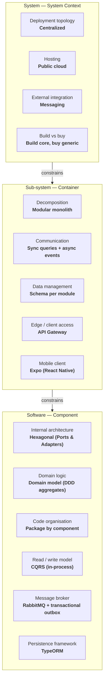

# ARCHITECTURE.md — SkillSwap

> Architectural contract for humans and coding agents. Generated by Architecture Decision Studio on 2026-10-02 by Group 4.
> Treat every rule in section 4 as a hard constraint. If a task cannot be completed without breaking a rule, stop and report the conflict instead of working around it.

## 1. Product context

# Intent: SkillSwap — A marketplace connecting students to teach and learn skills through a digital wallet

Author: Group 4. Status: draft.
Created: 2026-09-13

## Problem

University students have diverse skills but limited time and budget. They want to learn new skills (programming, design, languages, etc.) but cannot afford formal courses, and there's no trusted, structured way to find and pay a peer who genuinely knows the subject. Meanwhile, skilled students with real experience or certificates have no easy channel to teach and earn from what they know.

## Proposed outcome

SkillSwap is a platform where students top up a system wallet and use that balance to buy/join classes taught by other students who have had their skills or certificates verified. When a student joins a class, the learner's wallet is debited and the teacher's wallet is credited accordingly. A teacher's skills and certificates are verified by experienced people in the system before they're allowed to open a class.

## Affected users and systems

- **Learners** — Students in general, not limited to a specific school
- **Teachers** — Students who have passed skill/certificate verification
- **Verifiers** — A separate, specially invited group with domain expertise (not system admins), responsible for reviewing teachers' skills/certificates
- **Digital wallet system** — Top-ups, debiting learners, crediting teachers, transaction history
- **Payment gateway** — Handles real-money top-ups into the wallet (converted to internal credit) and payouts for teachers — the specific gateway will be chosen at the spec/technical design stage; out of scope for the intent
- **Credit/wallet ledger** — Internal currency unit (credit); default exchange rate of 1 credit = 1,000 VND for both top-ups and withdrawals (adjustable at the spec stage if needed)
- **Video call system** — Jitsi integration for online classes
- **Student verification system** — Manual school name entry + upload of student ID/enrollment confirmation
- **Skill/certificate verification system** — Teachers submit certificates/proof of skill for verifiers to review
- **Messaging system** — In-platform chat
- **Rating system** — Post-class reviews with comments

## Constraints

- Student verification: enter school name + upload a photo of student ID or enrollment confirmation — reviewed manually by admin
- No access to any school's student database — verification relies entirely on manual document review
- Teachers must be verified by a separate verifier group (specially invited, with domain expertise — not system admins) before they can open a class — the specific review process and criteria will be defined at the spec.md stage; not required to be settled at the intent level
- Online classes only — no way to verify offline sessions
- Wallet uses internal credit purchased with real money: learners top up real money via a payment gateway to convert into credit (1 credit = 1,000 VND), then use credit to buy classes; teachers receive credit and can withdraw it as real money
- The platform takes a 10% commission on every class transaction
- The process for teachers withdrawing credit as real money will be defined at the spec.md stage — not part of the intent-level decisions
- Session duration: 30 min minimum, 3 hours maximum
- Must book at least 24 hours in advance
- All communication through platform — no sharing personal contact info
- No automated report/account-lock system in the MVP — relies on ratings with comments after each class to surface bad behavior (no-shows, harassment, teaching not as advertised, spam, etc.); low-rated profiles will have reduced visibility/be hidden from search results

- **Domain:** education
- **Primary users:** university students
- **Team:** 6 developers · **Timeline:** 6 weeks · **Infrastructure budget:** low

### Modules / bounded contexts

- Admin operation
- Student verification
- Skill verification
- Account + Profile
- Live class
- Wallet + Ledger
- Schedule

### Context characteristics

- Sensitive data, with legal constraints on where it is stored
- Requires real-time updates to users
- Complex business logic with many rules and invariants

### Constraints

- No school database integration; student verification is fully manual. + Can be integrate with OCR
- Online classes only (Jitsi).
- Class duration 30 min–3 h; booking at least 24 h in advance.
- Initial rate 1 credit = 1,000 VND; changes require approval and versioning.
- Platform fee 10% per class purchase; 90% allocated to Teacher.
- Vietnamese and English only; no mixed language on one screen.
- Stack: Next.js frontend, NestJS backend, PostgreSQL with TypeORM/Prisma.
- All class communication stays in-platform; contact sharing is prohibited per approved policy.
- MVP has no automated report/account-lock system; ratings + comments surface bad behavior.

## 2. Quality attribute drivers

| Quality attribute | Priority (0–3) | Scenario → response measure |
| --- | --- | --- |
| Performance | 3 | The platform must support live classes, so response time in live sessions must be fast (ideally < 1s), and overall performance must be fast enough to improve the user experience; frequently accessed pages and data need to be cached |
| Cost efficiency | 3 | In its early stage, the platform needs operating costs low enough to sustain itself and attract users |
| Scalability | 2 | The number of students grows every year, so the system must scale to handle a sufficiently large load; the MVP is estimated to need 10,000 concurrently active users |
| Security & Privacy | 2 | Sensitive data must be protected, such as student information, student ID cards, student proof documents, and skill/competency verification data... |
| Modifiability | 2 | The project structure must be flexible enough to meet domain needs over time if policies change in the future |
| Testability | 2 | Because the system is domain-heavy, tests should be written first, defining the API contract before implementing any feature |
| Interoperability | 2 | The system needs to integrate with existing systems so the team only has to build the core features |
| Time-to-market | 2 | The team is small, so the product build procedure need not be overly complex, but it must still ensure good CI/CD; releasing new features must not affect the availability of the running product |
| Availability | 1 | — |
| Deployability | 1 | — |

## 3. Architecture at a glance

| Level | Decision | Choice | ADR | Status |
| --- | --- | --- | --- | --- |
| System | Deployment topology | Centralized | ADR-001 | Accepted |
| System | Hosting | Public cloud | ADR-002 | Accepted |
| System | External integration | Messaging | ADR-003 | Accepted |
| System | Build vs buy | Build core, buy generic | ADR-004 | Accepted |
| Sub-system | Decomposition | Modular monolith | ADR-005 | Accepted |
| Sub-system | Communication | Sync queries + async events | ADR-006 | Accepted |
| Sub-system | Data management | Schema per module | ADR-007 | Accepted |
| Sub-system | Edge / client access | API Gateway | ADR-008 | Accepted |
| Sub-system | Mobile client | Expo (React Native) | ADR-015 | Accepted |
| Software | Internal architecture | Hexagonal (Ports & Adapters) | ADR-009 | Accepted |
| Software | Domain logic | Domain model (DDD aggregates) | ADR-010 | Accepted |
| Software | Code organisation | Package by component | ADR-011 | Accepted |
| Software | Read / write model | CQRS (in-process) | ADR-012 | Accepted |
| Software | Message broker | RabbitMQ + transactional outbox | ADR-013 | Accepted |
| Software | Persistence framework | TypeORM | ADR-014 | Accepted |



## 4. Implementation rules for coding agents

### System level

- [ADR-001 · Centralized] Deploy a single production environment; all clients talk to it over HTTPS.
- [ADR-001 · Centralized] Keep the application tier stateless so it can run 2+ instances behind a load balancer.
- [ADR-002 · Public cloud] Define all infrastructure as code (Terraform, Bicep or CDK); no manual console changes.
- [ADR-002 · Public cloud] Prefer managed services for database, queue and object storage.
- [ADR-003 · Messaging] Publish integration events through a transactional outbox; never publish inside the business transaction directly.
- [ADR-003 · Messaging] Consumers are idempotent (store processed message ids) and failed messages go to a dead-letter queue after N retries.
- [ADR-003 · Messaging] Translate external formats in an anti-corruption layer; the domain never sees external schemas.
- [ADR-004 · Build core, buy generic] Put every third-party service behind an internal interface (port) with one adapter per provider.
- [ADR-004 · Build core, buy generic] Never call a vendor SDK from domain or application code.

### Sub-system level

- [ADR-005 · Modular monolith] One deployable; one top-level package per module (bounded context).
- [ADR-005 · Modular monolith] A module exposes a public API package; other modules may import only that package.
- [ADR-005 · Modular monolith] A module owns its tables (own schema); never query another module's tables.
- [ADR-005 · Modular monolith] Cross-module side effects go through in-process domain events.
- [ADR-006 · Sync queries + async events] Use synchronous HTTP only for requests whose result the caller needs immediately.
- [ADR-006 · Sync queries + async events] Everything else (notifications, integrations, projections) is an event published through the outbox.
- [ADR-007 · Schema per module] Each module has its own database schema and its own migrations folder.
- [ADR-007 · Schema per module] No SQL query or ORM mapping touches another module's schema; cross-module data goes through the module's public API or events.
- [ADR-008 · API Gateway] All external traffic enters through the gateway; backends are not reachable from the internet.
- [ADR-008 · API Gateway] The gateway validates tokens and forwards the user identity in a trusted header.
- [ADR-015 · Expo mobile client] The mobile app is a separate deployable (`apps/mobile`) that calls the gateway like the web app; it never reaches the database, broker or backend directly.
- [ADR-015 · Expo mobile client] Mobile and web share `packages/contracts` (Zod schemas) and the same public REST contract; do not fork business rules into the client.

### Software level

- [ADR-009 · Hexagonal (Ports & Adapters)] Packages: domain (entities, value objects), application (use cases, ports), adapters/in (web, messaging), adapters/out (persistence, external clients).
- [ADR-009 · Hexagonal (Ports & Adapters)] domain and application must not import framework, ORM, HTTP or SDK packages.
- [ADR-009 · Hexagonal (Ports & Adapters)] Ports are interfaces in application; adapters implement them and are wired in a composition root.
- [ADR-010 · Domain model (DDD aggregates)] Aggregates change state only through intention-revealing methods (book(), cancel(), confirm()); no public setters.
- [ADR-010 · Domain model (DDD aggregates)] One transaction modifies one aggregate; other aggregates react through domain events.
- [ADR-010 · Domain model (DDD aggregates)] Entity status values are an enum with an explicit transition table; illegal transitions throw a domain exception.
- [ADR-011 · Package by component] Each component exposes one public interface; implementation classes are internal/package-private.
- [ADR-011 · Package by component] Other components depend only on the public interface.
- [ADR-012 · CQRS (in-process)] Commands go through application services and aggregates; queries are separate query handlers returning DTOs and never load aggregates.
- [ADR-013 · RabbitMQ] Publishers write outbox rows in the same transaction; only the relay in `apps/api/src/shared/messaging` reaches the broker (topic exchange `skillswap.events`).
- [ADR-013 · RabbitMQ] Every consumer binds its own durable queue with `.retry` + `.dlq` companions and deduplicates on `messageId` before applying side effects.
- [ADR-014 · TypeORM] TypeORM only; one entity set per module schema, no cross-schema joins or foreign keys, per-module credentials from `ApiConfig.databaseCredentials`.
- [ADR-014 · TypeORM] `typeorm` is imported only under `adapter/out/persistence/`; domain and application import neither `typeorm` nor `@nestjs/*`.

### Global rules

- Do not introduce a new deployable unit, datastore, message broker or architectural layer without a new ADR.
- Keep dependencies pointing in the directions stated above; never add a shortcut import to make a feature work.
- When a rule here conflicts with a task, stop and report the conflict; do not silently diverge.
- Every new rule-carrying behaviour ships with tests; `pnpm test:arch` (dependency-cruiser) must stay green.

## 5. Suggested source layout

The repository is a pnpm monorepo: `apps/gateway` (BFF, :4000), `apps/api` (the modular monolith below, :4001), `apps/web` (Next.js, :3000), `apps/mobile` (Expo/React Native, ADR-015), and `packages/contracts` (shared Zod schemas).

```text
apps/api/src/
├── modules/
│   ├── admin-operation/
│   │   ├── api/        (public interface, the only package other modules may import)
│   │   ├── internal/domain/
│   │   ├── internal/application/
│   │   ├── internal/application/port/in/
│   │   ├── internal/application/port/out/
│   │   ├── internal/adapter/in/web/
│   │   └── internal/adapter/out/persistence/
│   ├── student-verification/
│   │   ├── api/        (public interface, the only package other modules may import)
│   │   ├── internal/domain/
│   │   ├── internal/application/
│   │   ├── internal/application/port/in/
│   │   ├── internal/application/port/out/
│   │   ├── internal/adapter/in/web/
│   │   └── internal/adapter/out/persistence/
│   ├── skill-verification/
│   │   ├── api/        (public interface, the only package other modules may import)
│   │   ├── internal/domain/
│   │   ├── internal/application/
│   │   ├── internal/application/port/in/
│   │   ├── internal/application/port/out/
│   │   ├── internal/adapter/in/web/
│   │   └── internal/adapter/out/persistence/
│   ├── account-profile/
│   │   ├── api/        (public interface, the only package other modules may import)
│   │   ├── internal/domain/
│   │   ├── internal/application/
│   │   ├── internal/application/port/in/
│   │   ├── internal/application/port/out/
│   │   ├── internal/adapter/in/web/
│   │   └── internal/adapter/out/persistence/
│   ├── live-class/
│   │   ├── api/        (public interface, the only package other modules may import)
│   │   ├── internal/domain/
│   │   ├── internal/application/
│   │   ├── internal/application/port/in/
│   │   ├── internal/application/port/out/
│   │   ├── internal/adapter/in/web/
│   │   └── internal/adapter/out/persistence/
│   ├── wallet-ledger/
│   │   ├── api/        (public interface, the only package other modules may import)
│   │   ├── internal/domain/
│   │   ├── internal/application/
│   │   ├── internal/application/port/in/
│   │   ├── internal/application/port/out/
│   │   ├── internal/adapter/in/web/
│   │   └── internal/adapter/out/persistence/
│   └── …
├── shared/        (technical utilities only — config, messaging relay, cross-cutting; no business rules)
└── bootstrap/     (composition root, configuration)
```

_Derived from Package by component × Hexagonal (Ports & Adapters). Adapt names to the language's conventions._

Architecture fitness functions are enforced by `pnpm test:arch` (dependency-cruiser rules in `.dependency-cruiser.cjs`), not by a `tests/architecture/` folder.

## 6. Fitness functions (must stay green)

- [ ] **ADR-001** — Smoke tests run periodically against the production environment; monitor uptime ≥ the availability target.
- [ ] **ADR-002** — The pipeline can recreate the entire staging environment from infrastructure code.
- [ ] **ADR-003** — Shut-down test of an external system for 2 hours: no user-facing errors, and all messages are processed once it is back up.
- [ ] **ADR-004** — Architecture test: no domain/application package imports a vendor SDK.
- [ ] **ADR-005** — Architecture test (ArchUnit, Spring Modulith, NetArchTest, dependency-cruiser): no module accesses the internals of another module.
- [ ] **ADR-006** — The main flow contains no synchronous calls to external systems (verified via traces).
- [ ] **ADR-007** — Each module's database user only has permissions on its own schema.
- [ ] **ADR-008** — Network scan: no backend container exposes a port to the Internet.
- [ ] **ADR-009** — Architecture test: domain and application packages do not import frameworks/ORM; adapters depend only on ports.
- [ ] **ADR-010** — Unit tests for every valid state transition and the important invalid state transitions.
- [ ] **ADR-011** — The build fails when a component accesses the internal classes of another component.
- [ ] **ADR-012** — Architecture test: query handlers do not depend on the domain package.
- [ ] **ADR-013** — Shut RabbitMQ down, commit business transactions: they succeed (outbox rows accumulate); restart it: the outbox drains and consumers apply each event exactly once after deduplicating on `messageId`; poison messages land in the `.dlq` after N retries. Architecture test: nothing outside `apps/api/src/shared/messaging` imports `amqplib`.
- [ ] **ADR-014** — Architecture test: no file outside `adapter/out/persistence/` imports `typeorm`; `domain/` and `application/` import neither `typeorm` nor `@nestjs/*`. Each schema's role can only access its own schema (ADR-007).
- [ ] **ADR-015** — Grep across `docs/`, `PRODUCT.md`, `README.md` finds no remaining claim that native mobile is out of MVP scope; ARCHITECTURE.md and the C4 container view show the mobile client alongside web and match the code (`pnpm verify` green). When `apps/mobile` is scaffolded: `pnpm test:arch` includes and passes `isolated-app-mobile`.

## 7. Architecture Decision Records

### ADR-001: Overall deployment model — Centralized

- **Status:** Accepted
- **Level:** System (C4 Level 1 · System Context)
- **Date:** 2026-10-02

**Context.** Is the system deployed centrally, distributed across branches, or serving multiple customers from a single instance?

Decision drivers: Performance, Cost efficiency, Scalability, Security & Privacy, Modifiability, Testability, Interoperability, Time-to-market.

**Options considered.**

| Driver | Weight | Centralized | Distributed / Federated |
| --- | --- | --- | --- |
| Performance | 3 | 4 | 4 |
| Cost efficiency | 3 | 5 | 2 |
| Scalability | 2 | 3 | 4 |
| Security & Privacy | 2 | 4 | 3 |
| Modifiability | 2 | 3 | 2 |
| Testability | 2 | 4 | 2 |
| Interoperability | 2 | 3 | 3 |
| Time-to-market | 2 | 5 | 2 |
| Availability | 1 | 3 | 5 |
| Deployability | 1 | 4 | 2 |
| **Weighted total (/5)** | | **3.90** | **2.85** |

**Decision.** Adopt **Centralized** (centralized, client–server). A single central system serves all users and all branches over the network.

**Rationale.** Centralized (centralized, client–server) was chosen because the number of branches is moderate, the network is stable, and data must be immediately consistent. This option is strong on the priority drivers: Performance, Cost efficiency, Testability, Deployability, Time-to-market. Compared with Distributed / Federated: higher weighted score (3.90 vs 2.85); Distributed / Federated has the problem that a small team will struggle to operate multiple nodes and synchronization mechanisms.

**Consequences.**

- (+) Simple, a single source of truth
- (+) Easy to operate, back up and monitor
- (+) Low cost
- (−) Single point of failure without redundancy
- (−) Depends on network connectivity

**Verification.** Smoke tests run periodically against the production environment; monitor uptime ≥ the availability target.

### ADR-002: Deployment infrastructure — Public cloud

- **Status:** Accepted
- **Level:** System (C4 Level 1 · System Context)
- **Date:** 2026-10-02

**Context.** Does the system run on a public cloud, on the organization's own infrastructure, or a combination of both?

Decision drivers: Performance, Cost efficiency, Scalability, Security & Privacy, Modifiability, Testability, Interoperability, Time-to-market.

Context notes: Check the data-hosting region and legal regulations.

**Options considered.**

| Driver | Weight | Public cloud | Hybrid |
| --- | --- | --- | --- |
| Performance | 3 | 4 | 3 |
| Cost efficiency | 3 | 4 | 2 |
| Scalability | 2 | 5 | 4 |
| Security & Privacy | 2 | 3 | 4 |
| Modifiability | 2 | 4 | 3 |
| Testability | 2 | 4 | 3 |
| Interoperability | 2 | 4 | 4 |
| Time-to-market | 2 | 5 | 2 |
| Availability | 1 | 4 | 4 |
| Deployability | 1 | 5 | 3 |
| **Weighted total (/5)** | | **4.15** | **3.10** |

**Decision.** Adopt **Public cloud**. Use the cloud provider's infrastructure and ready-made managed services (managed DB, queue, storage).

**Rationale.** Public cloud was chosen because we need to launch quickly, the load varies, and few people are available to operate the system. This option is strong on the priority drivers: Performance, Cost efficiency, Scalability, Modifiability, Testability, Interoperability, Deployability, Time-to-market. Compared with Hybrid: higher weighted score (4.15 vs 3.10); Hybrid has the problem that a small team will struggle to operate two environments.

**Consequences.**

- (+) Flexible scaling, pay-as-you-go
- (+) Managed services reduce operational effort
- (−) Vendor dependency
- (−) Costs may rise under a large, steady load

**Verification.** The pipeline can recreate the entire staging environment from infrastructure code.

### ADR-003: Integration style with external systems — Messaging

- **Status:** Accepted
- **Level:** System (C4 Level 1 · System Context)
- **Date:** 2026-10-02

**Context.** In what style does the system exchange data with external systems (especially legacy systems)?

Decision drivers: Performance, Cost efficiency, Scalability, Security & Privacy, Modifiability, Testability, Interoperability, Time-to-market.

**Options considered.**

| Driver | Weight | Messaging | Remote Procedure Invocation |
| --- | --- | --- | --- |
| Performance | 3 | 4 | 4 |
| Cost efficiency | 3 | 3 | 4 |
| Scalability | 2 | 5 | 3 |
| Security & Privacy | 2 | 4 | 4 |
| Modifiability | 2 | 4 | 3 |
| Testability | 2 | 3 | 4 |
| Interoperability | 2 | 4 | 4 |
| Time-to-market | 2 | 3 | 4 |
| Availability | 1 | 5 | 2 |
| Deployability | 1 | 4 | 4 |
| **Weighted total (/5)** | | **3.80** | **3.70** |

**Decision.** Adopt **Messaging** (asynchronous messaging: queue, pub/sub, webhook). The system sends messages through a broker; the receiver processes them when it is ready.

**Rationale.** Messaging (asynchronous messaging: queue, pub/sub, webhook) was chosen because the other system is unreliable, and we need fault tolerance and temporal decoupling. This option is strong on the priority drivers: Performance, Scalability, Modifiability, Interoperability, Deployability. Compared with Remote Procedure Invocation: higher weighted score (3.80 vs 3.70).

**Consequences.**

- (+) Fault tolerant: messages wait in the queue
- (+) Absorbs load spikes
- (+) Loose coupling
- (−) Eventual consistency
- (−) Adds a broker that must be operated; harder to trace

**Verification.** Shut-down test of an external system for 2 hours: no user-facing errors, and all messages are processed once it is back up.

### ADR-004: Build or buy — Build core, buy generic

- **Status:** Accepted
- **Level:** System (C4 Level 1 · System Context)
- **Date:** 2026-10-02

**Context.** Should supporting capabilities (payments, messaging, login, etc.) be built in-house or bought as ready-made services?

Decision drivers: Performance, Cost efficiency, Scalability, Security & Privacy, Modifiability, Testability, Interoperability, Time-to-market.

Context notes: Focus effort on the complex core domain.

**Options considered.**

| Driver | Weight | Build core, buy generic | Buy / SaaS |
| --- | --- | --- | --- |
| Performance | 3 | 4 | 3 |
| Cost efficiency | 3 | 4 | 3 |
| Scalability | 2 | 4 | 4 |
| Security & Privacy | 2 | 4 | 3 |
| Modifiability | 2 | 4 | 2 |
| Testability | 2 | 4 | 2 |
| Interoperability | 2 | 4 | 3 |
| Time-to-market | 2 | 4 | 5 |
| Availability | 1 | 4 | 4 |
| Deployability | 1 | 4 | 3 |
| **Weighted total (/5)** | | **4.00** | **3.15** |

**Decision.** Adopt **Build core, buy generic** (build the core, use services for supporting parts). Build the parts that create competitive advantage (core domain); use ready-made services for commodity parts (generic subdomains).

**Rationale.** Build core, buy generic (build the core, use services for supporting parts) was chosen because, as in most projects, the core domain is specific, while payments, SMS and login are common problems. This option is strong on the priority drivers: Performance, Cost efficiency, Scalability, Modifiability, Testability, Interoperability, Deployability, Time-to-market. Fits the context: focus effort on the complex core domain. Compared with Buy / SaaS: higher weighted score (4.00 vs 3.15); Buy / SaaS has the problem that complex business logic is hard to fit into off-the-shelf products.

**Consequences.**

- (+) Effort is focused on the value-creating parts
- (+) Faster launch than building everything
- (−) Dependence on many small vendors
- (−) Each service must be wrapped behind an interface

**Verification.** Architecture test: no domain/application package imports a vendor SDK.

### ADR-005: Decomposing the system into containers — Modular monolith

- **Status:** Accepted
- **Level:** Sub-system (C4 Level 2 · Container)
- **Date:** 2026-10-02

**Context.** Is the system split into a single deployable unit or into multiple independent services?

Decision drivers: Performance, Cost efficiency, Scalability, Security & Privacy, Modifiability, Testability, Interoperability, Time-to-market.

Context notes: Fits the team size; domain-based module boundaries keep the business logic tidy.

**Options considered.**

| Driver | Weight | Modular monolith | Serverless |
| --- | --- | --- | --- |
| Performance | 3 | 4 | 3 |
| Cost efficiency | 3 | 5 | 4 |
| Scalability | 2 | 3 | 5 |
| Security & Privacy | 2 | 4 | 4 |
| Modifiability | 2 | 4 | 3 |
| Testability | 2 | 4 | 3 |
| Interoperability | 2 | 3 | 4 |
| Time-to-market | 2 | 4 | 4 |
| Availability | 1 | 3 | 4 |
| Deployability | 1 | 3 | 5 |
| **Weighted total (/5)** | | **3.85** | **3.80** |

**Decision.** Adopt **Modular monolith** (a monolith divided into modules). A single deployable unit, divided into modules by domain (bounded context) with hard boundaries and their own public APIs.

**Rationale.** Modular monolith (a monolith divided into modules) was chosen because the team has 3–15 people, the domain is clear, and we want a fallback path toward microservices. This option is strong on the priority drivers: Performance, Cost efficiency, Modifiability, Testability, Time-to-market. Fits the context: fits the team size; domain-based module boundaries keep the business logic tidy. Compared with Serverless: higher weighted score (3.85 vs 3.80); Serverless would split business logic across functions, making the compiler-checked module boundaries of a modular monolith harder to enforce.

**Consequences.**

- (+) Separates domains without the cost of a distributed system
- (+) ACID transactions within the process
- (+) Modules can easily be extracted into services later
- (−) Requires discipline to maintain module boundaries
- (−) Still deployed and scaled together

**Verification.** Architecture test (ArchUnit, Spring Modulith, NetArchTest, dependency-cruiser): no module accesses the internals of another module.

### ADR-006: Communication between containers — Sync queries + async events

- **Status:** Accepted
- **Level:** Sub-system (C4 Level 2 · Container)
- **Date:** 2026-10-02

**Context.** Do containers call each other synchronously, send asynchronous messages, or combine both?

Decision drivers: Performance, Cost efficiency, Scalability, Security & Privacy, Modifiability, Testability, Interoperability, Time-to-market.

**Options considered.**

| Driver | Weight | Sync queries + async events | Synchronous REST |
| --- | --- | --- | --- |
| Performance | 3 | 4 | 3 |
| Cost efficiency | 3 | 4 | 5 |
| Scalability | 2 | 4 | 3 |
| Security & Privacy | 2 | 4 | 4 |
| Modifiability | 2 | 4 | 3 |
| Testability | 2 | 4 | 4 |
| Interoperability | 2 | 4 | 5 |
| Time-to-market | 2 | 4 | 5 |
| Availability | 1 | 4 | 2 |
| Deployability | 1 | 4 | 4 |
| **Weighted total (/5)** | | **4.00** | **3.90** |

**Decision.** Adopt **Sync queries + async events** (hybrid: synchronous for queries, asynchronous for secondary tasks). The main flow uses synchronous REST; secondary tasks and slow integrations are moved to events via a broker.

**Rationale.** Sync queries + async events (hybrid: synchronous for queries, asynchronous for secondary tasks) was chosen because, as in most business systems, users need results immediately, but there are many secondary tasks. This option is strong on the priority drivers: Performance, Cost efficiency, Scalability, Modifiability, Testability, Interoperability, Deployability, Time-to-market. Compared with Synchronous REST: higher weighted score (4.00 vs 3.90).

**Consequences.**

- (+) Fast responses; secondary tasks do not break the main transaction
- (+) Clear: what is synchronous and what is not
- (−) Two communication mechanisms to maintain
- (−) Clear conventions are needed on when to use which

**Verification.** The main flow contains no synchronous calls to external systems (verified via traces).

### ADR-007: Data management — Schema per module

- **Status:** Accepted
- **Level:** Sub-system (C4 Level 2 · Container)
- **Date:** 2026-10-02

**Context.** Is data stored in one shared database, split by module, split by service, or spread across multiple kinds of stores?

Decision drivers: Performance, Cost efficiency, Scalability, Security & Privacy, Modifiability, Testability, Interoperability, Time-to-market.

**Options considered.**

| Driver | Weight | Schema per module | CQRS + read model |
| --- | --- | --- | --- |
| Performance | 3 | 4 | 5 |
| Cost efficiency | 3 | 5 | 3 |
| Scalability | 2 | 3 | 5 |
| Security & Privacy | 2 | 4 | 4 |
| Modifiability | 2 | 4 | 3 |
| Testability | 2 | 4 | 3 |
| Interoperability | 2 | 3 | 3 |
| Time-to-market | 2 | 4 | 2 |
| Availability | 1 | 3 | 4 |
| Deployability | 1 | 3 | 3 |
| **Weighted total (/5)** | | **3.85** | **3.55** |

**Decision.** Adopt **Schema per module** (one database, a separate schema for each module). One database server, where each module owns its own schema; other modules access it only through that module's API.

**Rationale.** Schema per module (one database, a separate schema for each module) was chosen because this is a modular monolith and we want to be ready to split into services later. This option is strong on the priority drivers: Performance, Cost efficiency, Modifiability, Testability, Time-to-market. Compared with CQRS + read model: higher weighted score (3.85 vs 3.55).

**Consequences.**

- (+) Clear data boundaries while still using a single database
- (+) Easier to split into services
- (−) No direct joins between modules
- (−) Requires discipline and automated checks

**Verification.** Each module's database user only has permissions on its own schema.

### ADR-008: Edge and client layer — API Gateway

- **Status:** Accepted
- **Level:** Sub-system (C4 Level 2 · Container)
- **Date:** 2026-10-02

**Context.** Do clients (web, mobile) call the backend containers directly, through an API Gateway, or through a dedicated backend for each client type?

Decision drivers: Performance, Cost efficiency, Scalability, Security & Privacy, Modifiability, Testability, Interoperability, Time-to-market.

**Options considered.**

| Driver | Weight | API Gateway | Direct client-to-backend |
| --- | --- | --- | --- |
| Performance | 3 | 3 | 4 |
| Cost efficiency | 3 | 4 | 5 |
| Scalability | 2 | 4 | 3 |
| Security & Privacy | 2 | 5 | 2 |
| Modifiability | 2 | 4 | 2 |
| Testability | 2 | 4 | 4 |
| Interoperability | 2 | 4 | 3 |
| Time-to-market | 2 | 4 | 5 |
| Availability | 1 | 3 | 3 |
| Deployability | 1 | 4 | 3 |
| **Weighted total (/5)** | | **3.90** | **3.55** |

**Decision.** Adopt **API Gateway** (a shared API gateway). A single entry point handling TLS, authentication, rate limiting and routing to the backend containers.

**Rationale.** API Gateway (a shared API gateway) was chosen because there are multiple backend containers or a need for a centralized security policy. This option is strong on the priority drivers: Cost efficiency, Scalability, Modifiability, Testability, Interoperability, Deployability, Time-to-market. Compared with Direct client-to-backend: higher weighted score (3.90 vs 3.55).

**Consequences.**

- (+) Centralized security policy
- (+) Hides the internal structure from clients
- (−) Adds one more component, which can become a bottleneck
- (−) Routing configuration must be kept in sync

**Verification.** Network scan: no backend container exposes a port to the Internet.

### ADR-009: Internal architecture of the main container — Hexagonal (Ports & Adapters)

- **Status:** Accepted
- **Level:** Software (C4 Level 3 · Component)
- **Date:** 2026-10-02

**Context.** Inside the main container, in what style are the components organized and how do they depend on each other?

Decision drivers: Performance, Cost efficiency, Scalability, Security & Privacy, Modifiability, Testability, Interoperability, Time-to-market.

Context notes: Protect complex business logic from infrastructure details.

**Options considered.**

| Driver | Weight | Hexagonal (Ports & Adapters) | Pipe-and-filter |
| --- | --- | --- | --- |
| Performance | 3 | 4 | 4 |
| Cost efficiency | 3 | 3 | 4 |
| Scalability | 2 | 3 | 4 |
| Security & Privacy | 2 | 4 | 3 |
| Modifiability | 2 | 5 | 4 |
| Testability | 2 | 5 | 4 |
| Interoperability | 2 | 5 | 4 |
| Time-to-market | 2 | 3 | 4 |
| Availability | 1 | 3 | 3 |
| Deployability | 1 | 3 | 3 |
| **Weighted total (/5)** | | **3.85** | **3.80** |

**Decision.** Adopt **Hexagonal (Ports & Adapters)** (hexagon: ports and adapters). The domain and use cases sit at the center and define ports (interfaces); inbound adapters (REST, consumers) and outbound adapters (DB, broker, external APIs) implement the ports.

**Rationale.** Hexagonal (Ports & Adapters) (hexagon: ports and adapters) was chosen because there are many integrations, the infrastructure may need to be swapped, and business logic must be testable in isolation. This option is strong on the priority drivers: Performance, Modifiability, Testability, Interoperability. Fits the context: protecting complex business logic from infrastructure details. Compared with Pipe-and-filter: higher weighted score (3.85 vs 3.80).

**Consequences.**

- (+) The domain does not depend on frameworks or the DB
- (+) Swapping infrastructure only requires swapping an adapter
- (+) Pure unit tests of business logic
- (−) Many interfaces and mappings
- (−) Upfront effort

**Verification.** Architecture test: domain and application packages do not import frameworks/ORM; adapters depend only on ports.

### ADR-010: Where business logic lives — Domain model (DDD aggregates)

- **Status:** Accepted
- **Level:** Software (C4 Level 3 · Component)
- **Date:** 2026-10-02

**Context.** Do business rules live in procedures, in data records, or in a behavior-rich domain model?

Decision drivers: Performance, Cost efficiency, Scalability, Security & Privacy, Modifiability, Testability, Interoperability, Time-to-market.

Context notes: Put business invariants in aggregates.

**Options considered.**

| Driver | Weight | Domain model (DDD aggregates) | Transaction script |
| --- | --- | --- | --- |
| Performance | 3 | 4 | 4 |
| Cost efficiency | 3 | 3 | 5 |
| Scalability | 2 | 3 | 3 |
| Security & Privacy | 2 | 4 | 3 |
| Modifiability | 2 | 5 | 2 |
| Testability | 2 | 5 | 3 |
| Interoperability | 2 | 3 | 3 |
| Time-to-market | 2 | 2 | 5 |
| Availability | 1 | 3 | 3 |
| Deployability | 1 | 3 | 3 |
| **Weighted total (/5)** | | **3.55** | **3.55** |

**Decision.** Adopt **Domain model (DDD aggregates)** (behavior-rich domain model). Aggregates encapsulate state and rules; every state change goes through a method of the aggregate root, where invariants are preserved.

**Rationale.** Domain model (DDD aggregates) (behavior-rich domain model) was chosen because the business logic is complex, with many invariants (no double booking, limits, state lifecycles). This option is strong on the priority drivers: Performance, Modifiability, Testability. Fits the context: put business invariants in aggregates. Compared with Transaction script: scores tie (3.55 vs 3.55), but Transaction script has the problem that business invariants would be scattered across procedures. Accepted trade-off: low score on Time-to-market.

**Consequences.**

- (+) Invariants live in one place
- (+) The business language is present in the code
- (+) Pure unit tests of business logic
- (−) Requires deep domain understanding
- (−) Mapping between domain and persistence

**Verification.** Unit tests for every valid state transition and the important invalid state transitions.

### ADR-011: Code organisation — Package by component

- **Status:** Accepted
- **Level:** Software (C4 Level 3 · Component)
- **Date:** 2026-10-02

**Context.** Is the top-level source folder structure split by technical layer, by feature, or by component with a public interface?

Decision drivers: Performance, Cost efficiency, Scalability, Security & Privacy, Modifiability, Testability, Interoperability, Time-to-market.

**Options considered.**

| Driver | Weight | Package by component | Package by feature / module |
| --- | --- | --- | --- |
| Performance | 3 | 3 | 3 |
| Cost efficiency | 3 | 4 | 4 |
| Scalability | 2 | 3 | 3 |
| Security & Privacy | 2 | 4 | 3 |
| Modifiability | 2 | 5 | 4 |
| Testability | 2 | 4 | 4 |
| Interoperability | 2 | 3 | 3 |
| Time-to-market | 2 | 3 | 4 |
| Availability | 1 | 3 | 3 |
| Deployability | 1 | 4 | 4 |
| **Weighted total (/5)** | | **3.60** | **3.50** |

**Decision.** Adopt **Package by component** (split by component with a public interface). Each component has exactly one public interface; all implementation classes are kept in internal scope (internal/package-private).

**Rationale.** Package by component (split by component with a public interface) was chosen because a modular monolith needs compiler-checked boundaries. This option is strong on the priority drivers: Cost efficiency, Modifiability, Testability, Deployability. Compared with Package by feature / module: higher weighted score (3.60 vs 3.50).

**Consequences.**

- (+) The compiler blocks unauthorized access
- (+) The clearest boundaries
- (−) Limits how internal classes can be tested
- (−) Requires discipline in interface design

**Verification.** The build fails when a component accesses the internal classes of another component.

### ADR-012: Read and write model within the container — CQRS (in-process)

- **Status:** Accepted
- **Level:** Software (C4 Level 3 · Component)
- **Date:** 2026-10-02

**Context.** Use one shared model for reads and writes, or separate the command and query flows?

Decision drivers: Performance, Cost efficiency, Scalability, Security & Privacy, Modifiability, Testability, Interoperability, Time-to-market.

Context notes: Keep the domain model lean.

**Options considered.**

| Driver | Weight | CQRS (in-process) | Single model |
| --- | --- | --- | --- |
| Performance | 3 | 5 | 3 |
| Cost efficiency | 3 | 4 | 5 |
| Scalability | 2 | 4 | 3 |
| Security & Privacy | 2 | 3 | 3 |
| Modifiability | 2 | 4 | 3 |
| Testability | 2 | 4 | 4 |
| Interoperability | 2 | 3 | 3 |
| Time-to-market | 2 | 3 | 5 |
| Availability | 1 | 3 | 3 |
| Deployability | 1 | 3 | 3 |
| **Weighted total (/5)** | | **3.75** | **3.60** |

**Decision.** Adopt **CQRS (in-process)** (separate commands and queries within the same container). Commands go through the domain model; queries read directly using optimized queries or views and return DTOs.

**Rationale.** CQRS (in-process) (separate commands and queries within the same container) was chosen because there are many lookup and reporting screens, and the domain model is complex. This option is strong on the priority drivers: Performance, Cost efficiency, Scalability, Modifiability, Testability. Fits the context: keep the domain model lean. Compared with Single model: higher weighted score (3.75 vs 3.60).

**Consequences.**

- (+) A lean domain model that only handles writes
- (+) Queries can be optimized independently
- (−) Two code paths for the same data

**Verification.** Architecture test: query handlers do not depend on the domain package.

### ADR-013 … ADR-015 — held in `docs/adr/`

ADR-001 … ADR-012 are embedded above for historical context. The later records live only in the ADR folder (the repo's append-mostly convention from ADR-013 onward):

- [ADR-013](docs/adr/ADR-013-message-broker-rabbitmq.md) — Message broker: RabbitMQ, transactional outbox, idempotent consumers, DLQ (Accepted 2026-10-04)
- [ADR-014](docs/adr/ADR-014-persistence-typeorm.md) — Persistence framework: TypeORM, one schema + migration folder per module, per-module credentials (Accepted 2026-10-04)
- [ADR-015](docs/adr/ADR-015-mobile-client-expo.md) — Mobile client: Expo (React Native) joins MVP scope as Increment 6; authorizes this document's and the C4 sources' edits (Accepted 2026-10-06)

## 8. Open issues

- None.
