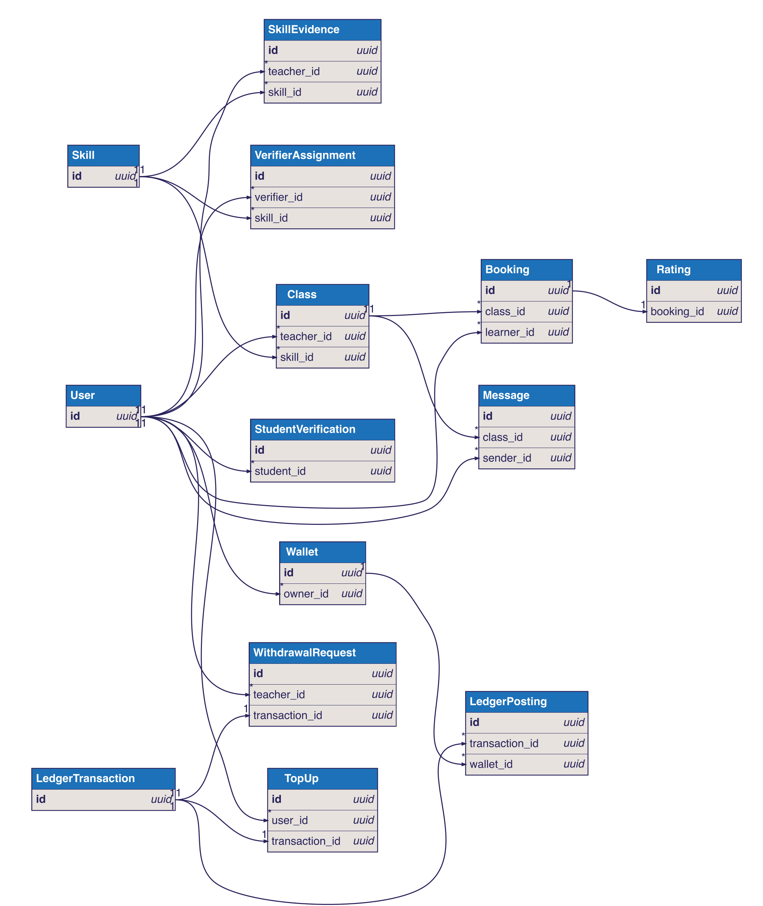
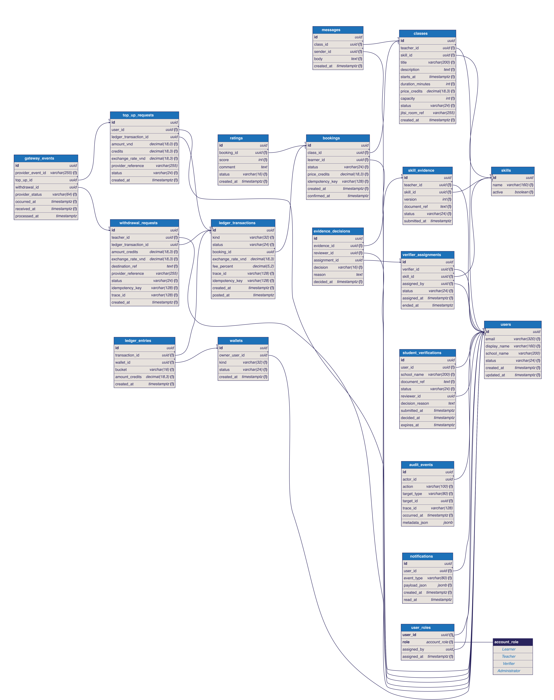

# SkillSwap MVP data model

Hai sơ đồ dưới đây dựa trên [product intent](../../intent.md), [PRD §9](../../plans/SkillSwap-PRD.md#9-data-model), [SRS Appendix B](../../plans/SkillSwap-SRS.md#appendix-b--data-dictionary) và các business rules trong BRD. Đây là bản thiết kế đề xuất để review, chưa phải migration hay quyết định thay cho Product Owner.

## Conceptual model

Nguồn: [skillswap-conceptual.dbml](skillswap-conceptual.dbml) · [SVG](skillswap-conceptual.svg) · [PNG](skillswap-conceptual.png)



Một `User` có thể là Learner và Teacher; `Verifier` và `Administrator` là vai trò được cấp. Teacher nộp `SkillEvidence` theo `Skill`, Verifier được phân công đúng kỹ năng, và Teacher mở `Class`. Learner tạo `Booking`, sau đó có thể gửi `Rating`. Ví và ledger ghi nhận nạp, mua lớp, phân bổ phí và rút tiền.

## Logical model

Nguồn: [skillswap-logical.dbml](skillswap-logical.dbml) · [SVG](skillswap-logical.svg) · [PNG](skillswap-logical.png)



Thiết kế logical dùng PostgreSQL và bổ sung khóa chính, khóa ngoại, unique key, index, trạng thái và trường audit. `skill_evidence` giữ từng phiên bản; `evidence_decisions` giữ quyết định duyệt. `ledger_transactions` là nhóm bút toán, `ledger_entries` là các thay đổi có dấu trên ví. Ví dụ đặt lớp 100 credit: Learner `-100` ở `available`, Teacher `+90` ở `pending`, ví phí nền tảng `+10` ở `available`. Số dư ví được tính từ các bút toán đã `posted`, tránh hai nguồn sự thật.

Các điều kiện cần thực thi bằng transaction, constraint hoặc kiểm tra ở API khi triển khai: chỉ một xác minh sinh viên hiệu lực trên mỗi tài khoản (BR-070); Teacher phải được duyệt đúng kỹ năng (BR-008, BR-015); lớp dài 30–180 phút (BR-017); booking trước ít nhất 24 giờ, không vượt sức chứa và không tự đặt lớp (BR-021, BR-025, BR-068); không có hai booking hợp lệ của cùng Learner cho cùng lớp (BR-024); booking cùng ledger commit nguyên tử (BR-026); tổng `ledger_entries.amount_credits` của một giao dịch bằng 0; xử lý webhook và idempotency key đúng một lần (BR-032, BR-033). DBML ghi các điều kiện này bằng `Note` khi bản thân định dạng không biểu đạt được partial index hoặc quy tắc xuyên bảng.

Các chính sách chưa chốt được giữ mở: taxonomy kỹ năng (OQ-001), giá (OQ-002), hủy/hoàn tiền (OQ-003), ngưỡng rating (OQ-004), rút tiền (OQ-005), quy tắc hoàn tất session, giải phóng thu nhập và reversal (OQ-006), sức chứa (OQ-007), thời hạn xác minh/lưu giấy tờ (OQ-008), xử lý thông tin liên hệ trong chat (OQ-009), gateway (OQ-011), làm tròn commission (OQ-012). Các giá trị chính sách này không được suy diễn thành ràng buộc đã duyệt.

## Regenerate images

Chạy từ thư mục gốc của repository:

```bash
npx --yes @softwaretechnik/dbml-renderer -i docs/diagrams/data/skillswap-conceptual.dbml -f svg -o docs/diagrams/data/skillswap-conceptual.svg
npx --yes @softwaretechnik/dbml-renderer -i docs/diagrams/data/skillswap-logical.dbml -f svg -o docs/diagrams/data/skillswap-logical.svg
npx --yes sharp-cli -i docs/diagrams/data/skillswap-conceptual.svg -o docs/diagrams/data/skillswap-conceptual.png flatten white
npx --yes sharp-cli -i docs/diagrams/data/skillswap-logical.svg -o docs/diagrams/data/skillswap-logical.png flatten white
```

SVG có thể phóng to mà không mất nét; PNG dành cho xem nhanh trong Markdown.
