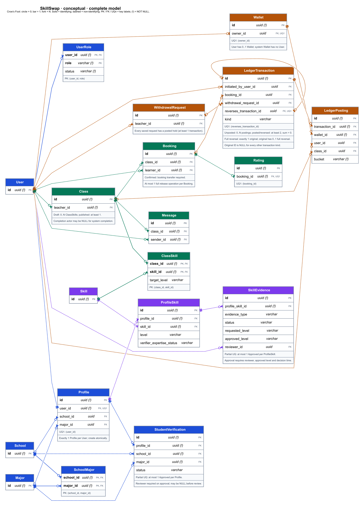
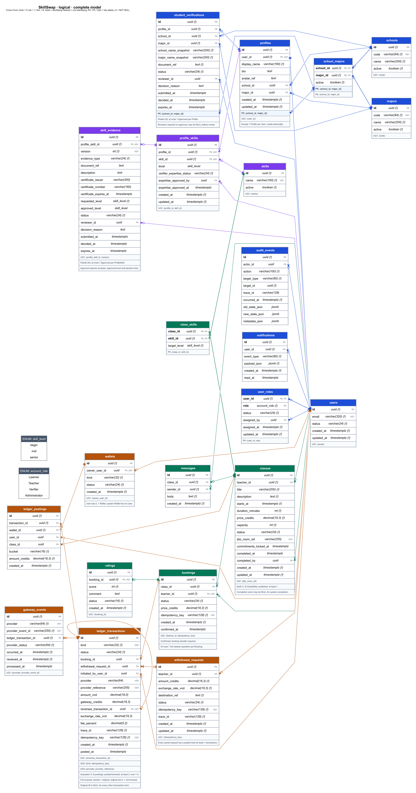

# SkillSwap MVP data model

ERD dựa trên [product intent](../../intent.md), [PRD §9](../../plans/SkillSwap-PRD.md#9-data-model), [SRS Appendix B](../../plans/SkillSwap-SRS.md#appendix-b--data-dictionary) và business rules trong BRD. Bản sửa ngày 2026-10-01 giữ mô hình hồ sơ, cấp độ kỹ năng, lớp nhiều kỹ năng và ledger; bổ sung giữ tiền payout, giải ngân một lần theo booking, quyền review, khóa cam kết lớp và lịch sử trạng thái. Đây là thiết kế dữ liệu, chưa phải migration hoặc hệ thống đã triển khai. Các chính sách được đánh dấu OQ vẫn chưa được chốt.

## Đọc quan hệ theo nhóm

Mở SVG theo nhóm để đọc đường nối chi tiết. Bốn hình dưới đây cùng lấy từ logical DBML, giữ nguyên các trường của từng bảng và bao phủ đủ 40 khóa ngoại. Bảng xuất hiện ở nhiều hình là cùng một bảng; mỗi hình chỉ vẽ quan hệ có cả hai đầu nằm trong nhóm đó.

| Nhóm | Nội dung | Hình |
|---|---|---|
| Hồ sơ và xác minh sinh viên | User, vai trò, trường/ngành, hồ sơ, xác minh, audit và thông báo | [SVG](skillswap-logical-identity.svg) · [PNG](skillswap-logical-identity.png) |
| Kỹ năng và minh chứng | ProfileSkill, SkillEvidence, chuyên môn và người duyệt | [SVG](skillswap-logical-skills.svg) · [PNG](skillswap-logical-skills.png) |
| Lớp và booking | Teacher, kỹ năng lớp, Learner, tin nhắn và rating | [SVG](skillswap-logical-learning.svg) · [PNG](skillswap-logical-learning.png) |
| Ví và giao dịch | Booking, ví, ledger, withdrawal và gateway event | [SVG](skillswap-logical-finance.svg) · [PNG](skillswap-logical-finance.png) |

Màu xanh dương chỉ nhóm hồ sơ, tím chỉ kỹ năng, xanh lá chỉ lớp/booking và nâu cam chỉ tài chính. Màu đường theo nhóm của bảng giữ khóa ngoại. Crow’s Foot dùng hai ký hiệu ở mỗi đầu: ký hiệu sát bảng thể hiện tối đa, ký hiệu tiếp theo thể hiện tối thiểu. Vòng tròn là 0, vạch là 1, chân quạ là nhiều. Vòng tròn + vạch biểu thị `0..1`; hai vạch là `1..1`; vòng tròn + chân quạ là `0..N`; vạch + chân quạ là `1..N`. [Quy ước Crow’s Foot của Microsoft Visio](https://support.microsoft.com/en-gb/visio/create-a-diagram-with-crow-s-foot-database-notation).

Nét liền biểu thị quan hệ định danh: FK là một phần của PK bảng con. Nét đứt biểu thị quan hệ không định danh; nét đứt không có nghĩa là nullable. Nhãn `PK`/`FK` đánh dấu khóa ngay trên dòng trường. Các trường cùng nhãn `UQ1`, `UQ2`... **trong cùng bảng** tạo một unique key, được ghi lại ở chân bảng; không hiểu mỗi trường của unique key ghép là unique riêng. Dấu `(!)` là NOT NULL, bao gồm tính bắt buộc vốn có của PK. Các hộp enum chỉ giải thích kiểu dữ liệu, không phải bảng có khóa ngoại.

Nullability của FK xác định một bản ghi con có bắt buộc liên kết cha hay không; không suy ra cha phải có ít nhất một con. Hình dùng tối thiểu 0 ở phía con, ngoại trừ hai quy tắc nghiệp vụ có sẵn: tạo đúng một Profile cùng User và lưu WithdrawalRequest cùng giao dịch hold. Các yêu cầu phụ thuộc trạng thái được ghi ngay dưới bảng: Class Published phải có skill; giao dịch đã post phải có ít nhất hai postings; quyết định Approved phải có người duyệt. Các điều kiện này vẫn phải được thực thi khi triển khai, không tự được bảo đảm chỉ bởi hình vẽ hoặc FK.

Đường nối vào đúng dòng khóa; chỗ giao nhau có viền trắng và không biểu thị một quan hệ mới. Khi mở SVG trực tiếp trong trình duyệt, rê chuột lên đường để tô đỏ và xem tên hai đầu quan hệ. Bản tổng thể bên dưới giữ toàn bộ bảng và quan hệ để đối chiếu.

## Conceptual model

Nguồn: [skillswap-conceptual.dbml](skillswap-conceptual.dbml) · [SVG](skillswap-conceptual.svg) · [PNG](skillswap-conceptual.png)



Một `User` có đúng một `Profile`, có thể đồng thời là Learner và Teacher. `UserRole` giữ vai trò được cấp cùng trạng thái Active/Suspended/Revoked. `Profile` liên kết trường, ngành, các yêu cầu xác minh sinh viên và nhiều kỹ năng qua `ProfileSkill`. Mỗi kỹ năng có nhiều phiên bản `SkillEvidence`; level được phép dạy đến từ evidence Approved còn hiệu lực. Trong MVP, một `Class` là một buổi học trực tuyến có một Teacher, một lịch và nhiều kỹ năng qua `ClassSkill`; không có bảng Session riêng.

## Logical model

Nguồn: [skillswap-logical.dbml](skillswap-logical.dbml) · [SVG](skillswap-logical.svg) · [PNG](skillswap-logical.png)



Thiết kế logical dùng PostgreSQL, thể hiện khóa chính, khóa ngoại, unique key, trạng thái và trường audit. Index phục vụ truy vấn được lưu trong DBML. Bảng sau đọc từ một bản ghi ở phía trái sang số bản ghi liên quan ở phía phải; hai đầu của từng đường nối trên hình thể hiện đầy đủ cả hai chiều.

| Quan hệ | Cardinality | Cách quản lý |
|---|---|---|
| User → Profile | 1..1 | `profiles.user_id` UNIQUE; tạo cùng transaction với User. Chiều Profile → User cũng là 1..1. FK/UNIQUE riêng không bảo đảm User đã có Profile. |
| User → UserRole | 0..N | Khóa chính `(user_id, role)`; mỗi grant có đúng một User; đình chỉ/thu hồi giữ lịch sử. |
| User → Wallet | 0..1 | Chiều Wallet → User là 0..1 vì ví hệ thống không có chủ User. |
| School → Major, qua SchoolMajor | 0..N | Quan hệ nhiều–nhiều được tách bằng `school_majors`; mỗi dòng nối có đúng một School và một Major. |
| Profile → StudentVerification | 0..N | Giữ từng lần nộp; tối đa một xác minh Approved còn hiệu lực trên mỗi hồ sơ (BR-070). |
| Profile → Skill, qua ProfileSkill | 0..N | `profile_skills` UNIQUE `(profile_id, skill_id)`; mỗi dòng nối có đúng một Profile và một Skill. |
| ProfileSkill → SkillEvidence | 0..N | Giữ từng phiên bản; mỗi evidence có đúng một ProfileSkill; người duyệt có thể NULL trước quyết định. |
| Class → Skill, qua ClassSkill | 0..N | Draft có thể chưa có skill; Published phải có ít nhất một. Mỗi ClassSkill có đúng một Class và một Skill. |
| Booking → Rating | 0..1 | `ratings.booking_id` UNIQUE; chiều Rating → Booking là 1..1. |
| Booking → LedgerTransaction | 0..N | Confirmed phải có giao dịch booking; tối đa một thao tác release đầy đủ. FK booking có thể NULL cho giao dịch khác loại. |
| WithdrawalRequest → LedgerTransaction | 1..N | Request được lưu cùng posted hold. Chiều giao dịch → request là 0..1 vì các giao dịch khác loại có thể không có request. |
| LedgerTransaction → LedgerPosting | 0..N | Chưa post có thể chưa có bút toán; Posted/Reversed phải giữ ít nhất hai bút toán không bằng 0, tổng bằng 0 và đúng mẫu nghiệp vụ. |
| LedgerPosting → Wallet | 1..1 | Mỗi bút toán thuộc đúng một ví. |
| LedgerPosting → User / Class | 0..1 mỗi quan hệ | User NULL cho ví hệ thống; Class NULL cho giao dịch không liên quan lớp. Các trường hợp bắt buộc tùy kind được kiểm tra tại commit. |
| Giao dịch gốc → full reversal | 0..1 | `reverses_transaction_id` UNIQUE và nullable; chỉ kind reversal có trường này, bắt buộc trỏ tới đúng một giao dịch gốc. |

### Hồ sơ, trường và ngành

`schools` và `majors` là danh mục do Administrator quản lý, có mã duy nhất và trạng thái hoạt động. `school_majors` ngăn chọn ngành không thuộc trường. Khi trường/ngành đã được tham chiếu, ngừng sử dụng bằng trạng thái thay vì xóa lịch sử. Hồ sơ chưa hoàn tất hoặc Verifier được mời từ bên ngoài có thể chưa có trường/ngành; khi nộp xác minh sinh viên phải có đủ cặp hợp lệ.

`student_verifications` liên kết `profile_id`, giữ trường/ngành và tên trường/ngành tại thời điểm nộp cùng tài liệu riêng tư, người duyệt, thời gian và lý do quyết định. Giữ các trạng thái Draft/Pending/Approved/Rejected/Superseded/Revoked/Expired: duyệt thay thế chuyển bản cũ sang Superseded; thu hồi hoặc đổi trường/ngành chuyển bản đang hiệu lực sang Revoked kèm lý do; hết hạn chuyển Expired. Nộp lại tạo dòng mới, không sửa bản đã submit. Phải kiểm tra thời hạn tại thời điểm cấp quyền, kể cả khi tác vụ cập nhật Expired chưa chạy. Khi duyệt bản mới, chuyển bản Approved cũ sang trạng thái phù hợp trong cùng transaction trước khi kích hoạt bản mới.

Việc chuẩn hóa danh mục không tạo tích hợp với cơ sở dữ liệu trường; Administrator vẫn review thủ công theo intent. Thông tin thiếu trong danh mục phải được xử lý qua quản lý danh mục, không tự tạo trường hoặc ngành trùng lặp khi nộp hồ sơ. Thời hạn xác minh, lưu giấy tờ và cách xử lý booking đã có khi mất hiệu lực vẫn theo OQ-008.

### Cấp độ và minh chứng kỹ năng

| Level | Ý nghĩa tương đối |
|---|---|
| `begin` | Nắm kiến thức nền tảng, thực hiện được nhiệm vụ cơ bản theo hướng dẫn. |
| `mid` | Tự thực hiện nhiệm vụ phổ biến, giải thích cách làm và xử lý vấn đề thường gặp. |
| `senior` | Xử lý vấn đề phức tạp, đánh giá giải pháp và hướng dẫn người khác. |

Level thuộc **kỹ năng của từng hồ sơ**, không thuộc năm học, ngành học hoặc toàn bộ tài khoản. Một Teacher có thể ở `senior` với Python và `begin` với thiết kế. Mô tả trên là định hướng; tiêu chí đánh giá cụ thể theo từng skill cần được thống nhất trong taxonomy OQ-001. `class_skills.target_level` là level lớp hướng tới; Teacher phải được duyệt ở level bằng hoặc cao hơn theo thứ tự `begin < mid < senior`.

`skill_evidence.evidence_type` có hai giá trị:

- `certificate`: nộp tài liệu chứng chỉ, có thể kèm đơn vị cấp, số chứng chỉ và ngày hết hạn. Chứng chỉ được người có thẩm quyền kiểm tra trước khi Approved.
- `verifier_recognition`: Verifier công nhận năng lực qua phần mô tả minh chứng hoặc kết quả đánh giá được lưu; không bắt buộc phải có chứng chỉ.

`requested_level` lưu level của từng phiên bản khi nộp; `approved_level` lưu level được Verifier công nhận. **Evidence Approved còn hiệu lực là nguồn xác định quyền dạy**: `approved_level` phải bằng hoặc cao hơn `class_skills.target_level`, đồng thời chưa hết hạn xác minh hoặc chứng chỉ. `profile_skills.level` chỉ là cache của level đã duyệt, NULL trước lần duyệt đầu tiên hoặc khi không còn approval hiệu lực; người dùng không tự chỉnh trường này để cấp quyền.

Khi Teacher đang ở `mid` và xin `senior`, bản mới giữ `requested_level = senior` trong lúc bản cũ vẫn cấp quyền `mid` nếu còn hiệu lực. Từ chối bản mới giữ quyền cũ. Duyệt bản mới phải khóa ProfileSkill rồi atomically supersede bản cũ, cập nhật cache bằng `approved_level` thực tế và ghi audit. Nếu xin `senior` nhưng được duyệt `mid`, cache và quyền đều ở `mid`; không yêu cầu level được duyệt phải bằng level đã xin. Cache có thể bị trễ tác vụ expiry, nên kiểm tra quyền luôn đọc trạng thái/thời hạn của evidence.

Không có bảng `VerifierAssignment` hoặc bảng quyết định riêng. Verifier cập nhật `status`, `reviewer_id`, `decided_at`, `approved_level`, `decision_reason` trên evidence trong cùng transaction với `audit_events`. Chỉ một quyết định hợp lệ được thắng khi hai người duyệt đồng thời. Tài liệu đã nộp không được chỉnh sửa; nộp lại tạo version mới. Chỉ tối đa một evidence Approved trên mỗi ProfileSkill; duyệt phiên bản thay thế đồng thời chuyển bản cũ sang Superseded. Từ chối bản mới không tự hủy bản cũ còn hiệu lực.

Chuyên môn Verifier được Administrator công nhận qua `profile_skills.verifier_expertise_status`, `expertise_approved_by`, `expertise_approved_at`; quyền review đòi hỏi cả `user_roles.status = active` cho vai trò Verifier và chuyên môn đúng skill đang active. Teacher không tự chọn người duyệt, Verifier không tự duyệt kỹ năng của mình (BR-011–BR-013). Vai trò Administrator tự nó không cấp quyền duyệt kỹ năng; Administrator chỉ có thể review nếu được cấp riêng vai trò Verifier cùng chuyên môn hợp lệ. FR-018 yêu cầu lịch sử quyết định, không phải quyền override.

### Lớp nhiều kỹ năng

Bỏ `classes.skill_id`; dùng `class_skills`. Khi publish, sửa skill trước khi có booking hoặc nhận booking mới, phải kiểm tra Teacher còn xác minh sinh viên hiệu lực và đủ cấp độ được duyệt cho **tất cả** kỹ năng của lớp (BR-008, BR-015). Nếu một kỹ năng bị thu hồi/hết hạn, chặn bán thêm cho lớp liên quan; cách giải quyết booking đã có theo chính sách OQ-003 (đã resolved; AC-022–AC-027)/OQ-006/OQ-008.

Tại booking Confirmed đầu tiên, đặt `classes.commitments_locked_at` trong cùng transaction với booking và settlement. Từ đó khóa Teacher, tiêu đề/mô tả, ngày giờ, thời lượng và toàn bộ ClassSkills; không reset khóa khi booking bị hủy. Giá đã mua giữ ở `bookings.price_credits`. Việc hủy theo OQ-003 (đã resolved; AC-022–AC-027); MVP không cần bảng phiên bản lớp. Chỉnh lớp và booking đầu tiên phải cùng khóa dòng Class để không có thời điểm cam kết thay đổi sau khi đã bán.

Trạng thái Class thống nhất: Draft → Published/Full → In progress → Completed, hoặc Cancelled theo policy. Một Class có một lịch/phòng Jitsi; Completed lưu `completed_at`, `completed_by` (NULL nếu hệ thống xác nhận) và audit căn cứ hoàn tất. Quy tắc hoàn tất/giải ngân vẫn là OQ-006. Publish/sửa lịch phải tuần tự theo Teacher để ngăn hai buổi trùng nhau; booking phải khóa Class trước khi đếm chỗ và khóa ví theo cùng thứ tự ID trước khi tính lại số dư.

### Ledger và nạp tiền

Thống nhất tên `LedgerPosting` ở conceptual và `ledger_postings` ở logical. `ledger_transactions` giữ loại giao dịch, người khởi tạo, booking hoặc withdrawal request liên quan, trạng thái, trace ID, idempotency key và thông tin gateway. `initiated_by_user_id` bắt buộc với lệnh người dùng; NULL chỉ dành cho thao tác hệ thống có nguồn được audit. `ledger_postings` giữ số credit có dấu, ví, `user_id`, `class_id` và bucket `available`/`pending`/`payout_hold`.

| Trường hợp | Liên kết User / Class | Ví dụ bút toán |
|---|---|---|
| Đặt lớp 100 credit | User là chủ từng ví; cả ba dòng cùng Class | Learner available `-100`, Teacher pending `+90`, nền tảng available `+10`. |
| Nạp 100 credit | Ví người nạp có User; ví đối ứng hệ thống có User NULL; Class NULL | Người nạp available `+100`, gateway clearing `-100`. |
| Giải phóng 90 credit thu nhập | Cùng Teacher, Class và booking gốc | Teacher pending `-90`, Teacher available `+90`. |
| Giữ 80 credit để rút | Cùng Teacher; Class NULL | Teacher available `-80`, Teacher payout_hold `+80`. |
| Payout 80 credit thành công | Teacher và ví đối ứng; Class NULL | Teacher payout_hold `-80`, gateway clearing available `+80`. |
| Gateway xác nhận chưa chuyển tiền và thất bại | Cùng Teacher; Class NULL | Teacher payout_hold `-80`, Teacher available `+80`. |
| Hoàn toàn bộ booking trước release | Giữ Class và chủ ví; trỏ booking settlement gốc | Đảo bút toán Learner/Teacher pending/phí nền tảng theo policy. |
| Hoàn toàn bộ booking sau release, còn đủ tiền | Giữ Class/booking và liên kết từng giao dịch gốc | Đảo release rồi đảo booking trong cùng transaction; không chỉ ghi âm vào pending đã hết. |

`user_id` phải khớp `wallets.owner_user_id`; ví hệ thống có `user_id = NULL` và chỉ dùng bucket available. `class_id` bắt buộc cho giao dịch gắn booking và phải bằng `bookings.class_id`; nạp/rút/giữ/nhả tiền payout không gắn lớp thì để NULL. Người khởi tạo giao dịch có thể khác chủ ví nhận tiền. Chủ ví, kind ví, header tài chính và các bút toán đã post không được thay đổi hoặc thêm bút toán trễ.

Không có bảng `TopUp`/`top_up_requests`. Tạo `ledger_transactions.kind = top_up` với số tiền VND, credit dự kiến, tỷ giá áp dụng, provider/reference, trạng thái và khóa idempotency. `gateway_events` liên kết trực tiếp giao dịch ledger; UNIQUE `(provider, provider_event_id)` ngăn xử lý cùng sự kiện hai lần. Kiểm tra chữ ký, gateway reference, số tiền, trạng thái và thứ tự sự kiện trước khi post; callback và bút toán commit nguyên tử (BR-032, BR-033). API nạp tiền vẫn tồn tại vì tính năng vẫn được giữ.

Số dư tính từ bút toán có `posted_at`, bao gồm giao dịch gốc sau khi đánh dấu Reversed và giao dịch bù; bỏ giao dịch gốc ra khỏi tổng sẽ đảo tiền hai lần. Không lưu số dư độc lập làm nguồn sự thật thứ hai. Giao dịch booking và settlement phải commit nguyên tử (BR-026), khóa ví rồi tính lại số dư để không âm bất kỳ bucket người dùng nào khi chi/giữ/nhả tiền.

Mỗi booking có một giao dịch `booking` và một giao dịch giải ngân toàn bộ `release`; partial unique theo `booking_id` và từng kind bảo vệ định danh nghiệp vụ ngoài idempotency key của client. Retry dùng lại giao dịch đó. Release phải kiểm tra Class Completed, điều kiện giải ngân đã được duyệt và thu nhập chưa release của **chính booking**. Tổng Teacher pending không thay thế kiểm tra này. Với hai booking mỗi booking 90 credit, giải ngân booking A lần hai phải bị từ chối kể cả pending vẫn còn 90 từ booking B.

### Yêu cầu rút tiền và đối soát

`withdrawal_requests` giữ số credit, tỷ giá và đích nhận được khóa từ khi giữ tiền. Request có nhiều `ledger_transactions` qua `withdrawal_request_id`; provider/reference chỉ lưu trên giao dịch `withdrawal` đối ngoại, không lặp lại trên request. Mỗi request có tối đa một giao dịch cho từng kind `withdrawal_hold`, `withdrawal`, `withdrawal_release`.

Tạo request Pending cùng bút toán `withdrawal_hold` trong một transaction trước khi dispatch payout. Worker phải lưu giao dịch `withdrawal` Pending và provider idempotency key ổn định trước khi gọi gateway để callback/retry luôn tìm được giao dịch đối ngoại đã tồn tại; retry không tạo payout mới. Gọi gateway ngoài transaction database. Available 100, giữ 80 thì chỉ còn 20 để chi/giữ tiếp; yêu cầu rút thêm 80 phải thất bại.

Callback thành công post `withdrawal` và chuyển request Completed. Chỉ kết quả xác nhận chắc chắn chưa chuyển tiền mới post `withdrawal_release` và chuyển Failed. Hai nhánh khóa cùng request/ví, kiểm tra trạng thái và commit nguyên tử với audit/gateway event; không thể đồng thời payout và nhả hold. Timeout hoặc kết quả chưa rõ giữ Pending/Processing và giữ payout_hold đến khi callback/đối soát xác nhận. Request Failed không được payout lại; một lần rút mới cần request mới. `gateway_events` liên kết giao dịch gateway-facing `top_up` hoặc `withdrawal`, không liên kết các bước giữ/nhả nội bộ.

Reversal phải trỏ giao dịch gốc và giữ đúng booking/request context; chỉ cho một full reversal trên mỗi giao dịch gốc, retry dùng lại thao tác đó. Khi hoàn booking sau release còn đủ tiền và policy cho phép, đảo release rồi booking trong cùng transaction. Sau payout hoặc khi không đủ tiền, nguồn bù/thu hồi cần OQ-006 (chính sách hủy/hoàn tiền đã resolved ở OQ-003; AC-022–AC-027); không mặc định âm ví hoặc dùng tiền nền tảng. Partial refund/adjustment cũng cần policy trước khi hoàn thiện thiết kế. Gateway reversal mới phải được xác thực/đối soát và tạo bút toán bù, không sửa số tiền gốc. Khi policy cho phép hoàn toàn bộ payout đã được gateway trả lại, đảo giao dịch payout rồi hold trong cùng transaction để tiền về available thay vì bị giữ lại ở payout_hold; request chuyển Reversed, không chuyển Failed và không thực hiện nhánh nhả hold do thất bại.

### Lịch sử quyết định và audit

`audit_events.old_state_json/new_state_json` lưu trạng thái trước/sau đã lọc dữ liệu nhạy cảm. Mỗi chuyển trạng thái có actor hoặc nguồn hệ thống rõ ràng, thời gian, lý do theo loại hành động và trace ID tài chính. Với SkillEvidence, snapshot phải giữ `status`, `reviewer_id`, `decided_at`, `approved_level`, `decision_reason` trước/sau; việc thu hồi hoặc supersede không ghi đè lịch sử FR-018. Dùng cùng quy tắc cho StudentVerification, vai trò và xác nhận Completed. Audit chỉ append và commit cùng thay đổi; không chứa giấy tờ, nội dung tài liệu, đích nhận tiền, secret hay payload gateway thô.

### Ràng buộc và chính sách còn mở

DBML thể hiện cấu trúc; các `Note` chỉ mô tả yêu cầu, chưa thực thi SQL CHECK, partial unique index, phân quyền hay transaction xuyên bảng. Khi triển khai phải bổ sung các constraint này cùng kiểm tra trạng thái, trường bắt buộc theo loại evidence/giao dịch, chống duyệt đồng thời, audit và bất biến tài chính. Không hard-delete hồ sơ, danh mục, lớp hoặc ví đã được tham chiếu bởi evidence, booking hoặc ledger.

Các partial unique index dưới đây là đặc tả SQL bổ sung cho DBML, không phải migration đã chạy:

```sql
CREATE UNIQUE INDEX uq_student_approval
  ON student_verifications (profile_id) WHERE status = 'approved';
CREATE UNIQUE INDEX uq_skill_approval
  ON skill_evidence (profile_skill_id) WHERE status = 'approved';
CREATE UNIQUE INDEX uq_valid_booking
  ON bookings (class_id, learner_id)
  WHERE status IN ('confirmed', 'completed', 'disputed');
CREATE UNIQUE INDEX uq_booking_settlement
  ON ledger_transactions (booking_id) WHERE kind = 'booking';
CREATE UNIQUE INDEX uq_booking_release
  ON ledger_transactions (booking_id) WHERE kind = 'release';
CREATE UNIQUE INDEX uq_withdrawal_step
  ON ledger_transactions (withdrawal_request_id, kind)
  WHERE kind IN ('withdrawal_hold', 'withdrawal', 'withdrawal_release');
CREATE UNIQUE INDEX uq_full_reversal
  ON ledger_transactions (reverses_transaction_id);
CREATE UNIQUE INDEX uq_system_wallet
  ON wallets (kind) WHERE owner_user_id IS NULL;
```

Không lọc approval bằng `now()` trong partial index; kiểm tra thời hạn khi cấp quyền và chuyển trạng thái cũ trong transaction thay thế. Bổ sung CHECK cho tập trạng thái/kind/bucket, amount/rate/price dương, duration 30–180, capacity/version dương, score 1–5, cặp school/major cùng NULL hoặc cùng có giá trị, và chủ ví phù hợp kind. `reverses_transaction_id` phải có giá trị khi và chỉ khi kind reversal, không được bằng chính id; unique nullable cho phép nhiều giao dịch không có original nhưng tối đa một full reversal trên một original. Trường bắt buộc phụ thuộc trạng thái/evidence/kind cũng phải có CHECK hoặc kiểm tra transaction rõ ràng.

Các điều kiện nhiều dòng/bảng phải có service/trigger tại điểm commit: tổng bút toán bằng 0 và đúng đối tượng/tỷ lệ theo kind; giới hạn release theo booking; đúng request/hold và một kết quả payout; kiểm tra quyền và expiry; chống trùng lịch và tranh chỗ; khóa nội dung đã bán; bất biến header/postings và audit. Các handler dùng thứ tự khóa thống nhất, transaction ngắn và không gọi gateway khi đang giữ khóa. Index phục vụ hàng đợi review, lịch sử booking/withdrawal và tin nhắn đã được thêm vào logical model.

Giữ các ràng buộc hiện có: thời lượng 30–180 phút (BR-017); đặt trước ít nhất 24 giờ, đủ chỗ và không tự đặt lớp (BR-021, BR-025, BR-068); không có hai booking hợp lệ của cùng Learner cho cùng lớp (BR-024). Các chính sách chưa chốt: taxonomy/tiêu chí skill (OQ-001), giá (OQ-002), rating (OQ-004), rút tiền (OQ-005), hoàn tất session/giải phóng thu nhập/reversal (OQ-006), sức chứa (OQ-007), thời hạn xác minh/lưu giấy tờ (OQ-008), thông tin liên hệ trong chat (OQ-009), gateway (OQ-011), làm tròn commission (OQ-012). Hủy/hoàn tiền (OQ-003) đã resolved — xem AC-022–AC-027.

## Regenerate images

Chạy từ thư mục gốc của repository. [render-erd.cjs](render-erd.cjs) kiểm tra DBML, tạo hai bản tổng thể và bốn bản theo nhóm, rồi xuất SVG/PNG với cùng cách bố trí. Các dependency dưới đây chỉ phục vụ xuất tài liệu và được cài vào thư mục tạm:

```bash
erd_tools_dir="$(mktemp -d)"
npm install --prefix "$erd_tools_dir" --no-save --package-lock=false @softwaretechnik/dbml-renderer@1.0.31 @aduh95/viz.js@3.4.0 sharp@0.35.4
NODE_PATH="$erd_tools_dir/node_modules" node docs/diagrams/data/render-erd.cjs
python3 docs/diagrams/data/check-erd.py
```

SVG có thể phóng to mà không mất nét; PNG dành cho xem nhanh trong Markdown.

[check-erd.py](check-erd.py) kiểm tra số bảng/quan hệ, 16 FK nullable, ký hiệu vòng tròn thực sự có trong SVG, các trường hợp 1–1, full reversal, nét định danh, nhãn khóa, chú thích trạng thái và độ bao phủ của bốn hình theo nhóm. Đây là kiểm tra tài liệu; không chạy migration hoặc kiểm thử ứng dụng. Sau khi thay đổi schema có chủ ý, cập nhật các kỳ vọng trong script và kiểm tra lại hình bằng mắt.

Nguồn Mermaid của các lifecycle đã sửa được lưu cạnh PNG ở `docs/diagrams/srs-state-*.mmd` và phải khớp block tương ứng trong SRS §3.2.6. Xuất lại bằng Mermaid CLI:

```bash
for state_name in student-verification skill-evidence class withdrawal-request; do
  npx --yes @mermaid-js/mermaid-cli -i "docs/diagrams/srs-state-${state_name}.mmd" -o "docs/diagrams/srs-state-${state_name}.png" -b white -s 2
done
```
