# SkillSwap MVP Software Requirements Specification

**Status:** Ready for Review

**Version:** 1.0

**Owner:** Group 4

**Date:** 2026-09-25

**Standard:** IEEE 830-1998 / ISO/IEC/IEEE 29148:2018 outline

**Related documents:** `SkillSwap-PRD.md`, `SkillSwap-BRD.md`, `docs/intent.md`

**Requirement policy:** This SRS contains **confirmed requirements only**. Requirements whose content is governed by an unresolved Open Question (OQ-001–OQ-011 in the BRD) are stated only at their confirmed core; the unconfirmed portions are excluded from the body and listed for traceability in [Appendix A](#appendix-a—excluded-open-question-governed-clauses). Source status labels from the PRD (`Confirmed core`, `… open`) are preserved in the requirement tables.

---

## 1. Introduction

### 1.1 Purpose

This document specifies the software requirements for the **SkillSwap MVP**, a peer-to-peer online skill marketplace for university students. It defines the functional behavior, external interfaces, performance targets, constraints and attributes that the software must satisfy. Its intended audience is Group 4 Engineering/QA (implementation and test), the Product Owner (scope approval), and reviewers of the SWD392 deliverable.

### 1.2 Scope

SkillSwap MVP is a responsive, mobile-first **web application** in which:

- Students register, verify their student status, and learn from verified peer Teachers.
- Teachers are verified per skill by domain-expert Verifiers before they may publish classes.
- Classes are booked and paid with an internal **credit wallet** funded through a payment gateway; every financial effect is recorded in an auditable ledger with a 90/10 Teacher/platform split.
- Classes run online in **Jitsi** rooms granted per booking with time-bounded access, with in-platform chat and post-class ratings.

**Out of scope (MVP):** native mobile apps, AI matching/recommendation, automatic refunds, integration with school student databases, moderation/report tooling beyond ratings, offline classes, languages other than Vietnamese/English (see BRD §4.2).

### 1.3 Definitions, acronyms and abbreviations

| Term | Definition |
|---|---|
| Learner | A verified student who searches, books and attends classes. |
| Teacher | A student approved for at least one skill who publishes and teaches classes. |
| Verifier | An invited domain expert who reviews Teacher skill evidence. |
| Administrator | Platform operator who approves student verifications, manages Verifiers and handles exceptions. |
| Credit | Internal currency unit; initial rate 1 credit = 1,000 VND (BR-005). |
| Wallet | Per-user ledger-backed balance of available and pending credit. |
| Booking | A Learner's reservation of a seat in a Class, settled atomically against the wallet ledger. |
| Settlement | Atomic ledger posting that debits the Learner and splits the price 90% Teacher / 10% platform. |
| Class | A single online teaching session with skill, schedule, duration, price and capacity. |
| OQ-xxx | Open Question requiring Product Owner (or delegated) approval before the affected behavior is implemented. |
| FR / BR / NFR / UC / AC / API / EVT | Functional Requirement / Business Rule / Non-Functional Requirement / Use Case / Acceptance Criterion / API endpoint / Event (webhook) — as numbered in the PRD. |
| MVP | Minimum Viable Product. |
| Jitsi | Self-hosted or hosted Jitsi Meet video conferencing service used for classes. |

### 1.4 References

1. `docs/intent.md` — SkillSwap intent (problem, outcome, constraints, open questions).
2. `docs/plans/SkillSwap-PRD.md` v1.0 — Product Requirements Document (FR/BR/NFR/UC/AC/data model/API contract).
3. `docs/plans/SkillSwap-BRD.md` v1.0 — Business Requirements Document (scope, business rules, A/C/DEP, OQ-001–OQ-011).
4. `docs/plans/2026-09-15-001-feat-skillswap-mvp-requirements-plan.md` — requirements plan.
5. `docs/diagrams/c4/generated/structurizr-SystemContext.png` — system context diagram (C4 Level 1).
6. IEEE Std 830-1998, *IEEE Recommended Practice for Software Requirements Specifications*.
7. ISO/IEC/IEEE 29148:2018, *Systems and software engineering — Life cycle processes — Requirements engineering*.

### 1.5 Overview

Sections 2 and 3 follow the IEEE 830 structure: overall description, then specific requirements (external interfaces, functional requirements with use cases and state models, performance, design constraints, software system attributes). Appendices A–C carry excluded OQ-governed clauses, the data dictionary, and the acceptance criteria with traceability.

---

## 2. Overall description

### 2.1 Product perspective

SkillSwap is a standalone web application that depends on two external systems: a **Payment Gateway** (real-money top-up and payout) and **Jitsi** (video classrooms). The system context is shown below; container-level detail is in `docs/diagrams/c4/`.

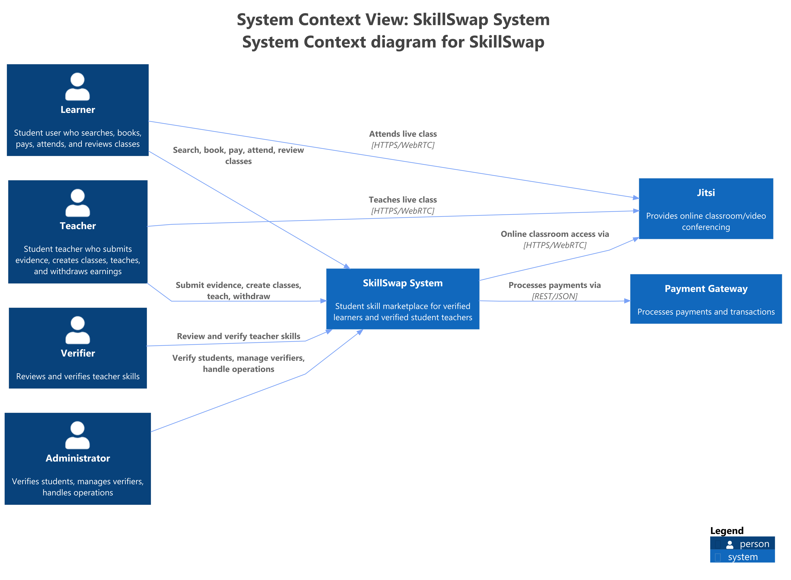

The software stack is fixed for the MVP: **Next.js (React)** frontend, **NestJS (Node.js)** backend, **PostgreSQL** persistence via **TypeORM/Prisma**. The backend provisions Jitsi rooms and issues short-lived access tokens; Learners and Teachers connect to Jitsi directly via WebRTC, so the backend handles only room metadata and access signaling, never media streams.

### 2.2 Product functions (summary)

1. **Accounts:** unified Learner/Teacher account registration, login, role view switching (FR-001, FR-017).
2. **Verification:** manual student-status verification by Administrators (FR-002); per-skill Teacher evidence review by matched Verifiers (FR-003, FR-004, FR-018).
3. **Marketplace:** verified Teachers publish classes (FR-005); Learners search/filter classes (FR-006); conditional booking (FR-007).
4. **Finance:** credit top-up via gateway (FR-008), atomic 90/10 settlement (FR-009), wallet balance/history (FR-010), Teacher withdrawal (FR-014).
5. **Learning:** time-bounded Jitsi room access (FR-011), in-booking chat (FR-012), one-shot post-class rating (FR-013).
6. **Operations:** Admin exception dashboard with filterable audit log (FR-015), status notifications (FR-016).

### 2.3 User characteristics

| User | Skill level | Key trait |
|---|---|---|
| Learner (persona: Minh, 2nd-year student) | Comfortable with mobile web; low tolerance for complex flows | Books classes on a phone; needs visible account status. |
| Teacher (persona: Lan, 4th-year student) | Intermediate; motivated by income | Publishes classes, tracks wallet, withdraws earnings. |
| Verifier (persona: Thầy Hùng, guest lecturer) | Expert in one domain; time-constrained | Reviews queue by domain; approve/reject with structured reasons. |
| Administrator (persona: Chị Trang, operations) | Power user | Runs verification queues, manages Verifiers, resolves exceptions. |

All four roles share one account model: a single account may hold both Learner and Teacher roles with an explicit role view (PRD §6.1).

### 2.4 Constraints

| ID | Constraint | Source |
|---|---|---|
| C-001 | No school database integration; student verification is fully manual. | BRD §8, Confirmed |
| C-002 | Online classes only (Jitsi). | BRD §8 / BR-007, Confirmed |
| C-003 | Class duration 30 min–3 h; booking at least 24 h in advance. | BRD §8 / BR-003, BR-004, Confirmed |
| C-004 | Initial rate 1 credit = 1,000 VND; changes require approval and versioning. | BRD §8, Confirmed default |
| C-005 | Platform fee 10% per class purchase; 90% allocated to Teacher. | BRD §8 / BR-006, Confirmed |
| C-006 | Mobile-first responsive web; no horizontal scrolling at 360 px/390 px. | PRD NFR-001, Confirmed |
| C-007 | Vietnamese and English only; no mixed language on one screen. | PRD NFR-002, Confirmed |
| C-008 | Stack: Next.js frontend, NestJS backend, PostgreSQL with TypeORM/Prisma. | Engineering decision |
| C-009 | All class communication stays in-platform; contact sharing is prohibited per approved policy. | BR-008, Confirmed (enforcement mechanism deferred — OQ-009) |
| C-010 | MVP has no automated report/account-lock system; ratings + comments surface bad behavior. | intent.md, Confirmed |

### 2.5 Assumptions and dependencies

**Assumptions (A-001–A-006, all Unconfirmed — BRD §8):** users hold a bank account/e-wallet compatible with the chosen gateway; users accept uploading student documents; enough domain-matched Verifiers exist before Teacher onboarding; users have stable Internet for Jitsi; initial Teacher supply covers 5–10 popular skill categories; Verifier review SLA is 48–72 h.

**Dependencies:**

| ID | Dependency | Status |
|---|---|---|
| DEP-001 | Payment gateway supporting top-up and payout in Vietnam. | Open (OQ-011) |
| DEP-002 | Jitsi self-hosted or as-a-service with secure domain/JWT. | Open |
| DEP-003 | Initial Verifier headcount. | Open |

---

## 3. Specific requirements

### 3.1 External interfaces

#### 3.1.1 User interfaces

- Responsive web UI, mobile-first (360 px, 390 px and desktop viewports); no horizontal scrolling; touch targets sized for touch; WCAG 2.2 AA on main flows (NFR-001, NFR-007).
- Main screens: register/login, Learner home + search, class detail, booking confirmation, student verification form, Teacher registration, Teacher dashboard, class publish/edit, wallet, classroom + chat, rating modal, public Teacher profile, Verifier dashboard, Administrator dashboard, notification center (PRD §8).
- Language: Vietnamese or English per locale, never mixed on one screen (NFR-002).
- Account status (including rejection reasons) must be visible on the Learner home screen with a resubmit path (FR-017).

#### 3.1.2 Hardware interfaces

None. The system is browser-based; the only client hardware assumptions are a camera/microphone for Jitsi participation on the user's own device.

#### 3.1.3 Software interfaces

| Interface | Direction | Contract |
|---|---|---|
| Payment gateway | Outbound (REST), inbound webhook `POST /api/webhooks/payment` (EVT-001) | Signature verification, timestamp/replay protection, monotonic status matrix, one application per provider event ID. Specific gateway is OQ-011 (excluded — Appendix A). |
| Jitsi | Outbound room provisioning + token issuance (`POST /api/bookings/{id}/room-token`, API-008) | Short-lived authorization for booking participants only; no discoverable public room link. Deployment choice (self-hosted vs. service) is DEP-002. |
| PostgreSQL | Internal persistence | TypeORM/Prisma data access; financial writes are transactional. |
| Email service | Outbound | Standard password-recovery flow (PRD §6.1). Provider not fixed at MVP scope level. |

#### 3.1.4 Communication interfaces

- All client–server traffic over HTTPS; JSON request/response bodies.
- REST API surface API-001–API-010 and webhook EVT-001 per PRD §10, each with defined auth, payload and error classes.
- Every command with financial effect carries an **idempotency key** and **trace ID**; gateway webhooks carry signature, timestamp and replay nonce.
- Notifications (FR-016) are emitted for: verification outcome, booking confirmed/cancelled, class starting soon, wallet transaction completed, withdrawal outcome. The delivery channel mix (in-app required; push/email optional) is not fixed by an approved requirement and is treated as in-app notification center for MVP scope (see Appendix A, OQ cross-reference).
- Jitsi media flows directly between participants and Jitsi (WebRTC); the application never carries media.

### 3.2 Functional requirements

Priority follows MoSCoW from the PRD (`Must` / `Should`). Status preserves the PRD's confirmed/open annotation.

#### 3.2.1 Requirement specification

| ID | Requirement (shall) | Priority | Source | Status |
|---|---|---|---|---|
| FR-001 | The system shall allow a student to create, sign in to, and manage one account used for the Learner role and Teacher registration. | Must | intent.md | Confirmed |
| FR-002 | The system shall allow a student to declare a school name and upload documents for Administrator approval or rejection with a reason. | Must | intent.md | Confirmed; retention open (OQ-008) |
| FR-003 | The system shall allow a Teacher candidate to submit skills, certificates or capability evidence, with resubmission after rejection. | Must | intent.md | Confirmed core; taxonomy open (OQ-001) |
| FR-004 | The system shall allow an Administrator to invite, assign domains to, suspend or revoke Verifiers; only a matched Verifier may approve a Teacher's evidence. | Must | intent.md | Confirmed |
| FR-005 | Only a verified Teacher shall be able to create and publish an online class with skill, description, schedule, duration, price and approved capacity rules. | Must | intent.md | Confirmed core; price/capacity open (OQ-002, OQ-007) |
| FR-006 | The system shall let a Learner browse and search open classes by class information and Teacher profile. | Must | intent.md | Confirmed core; taxonomy open (OQ-001) |
| FR-007 | The system shall only allow booking a class that has capacity, starts at least 24 hours from now, and lasts 30 minutes to 3 hours. | Must | intent.md | Confirmed core; capacity/refund open (OQ-003, OQ-007) |
| FR-008 | The system shall allow top-up through a payment gateway at the applied rate, with exactly-once callback processing. | Must | intent.md | Confirmed core; gateway open (OQ-011) |
| FR-009 | When a Learner buys a class, the system shall atomically debit the full price and allocate 90% to the Teacher and 10% platform fee. | Must | intent.md | Confirmed split; release timing open (OQ-006) |
| FR-010 | The system shall let a wallet owner view balance and history of top-ups, payments, income, fees and withdrawals. | Must | intent.md | Confirmed core |
| FR-011 | The system shall grant the Learner and Teacher of a booking access to the correct Jitsi room within the permitted time window. | Must | intent.md | Confirmed core |
| FR-012 | The system shall provide in-class chat to booking participants only; outsiders shall be denied and contact sharing handled per approved policy. | Should | intent.md | Confirmed; enforcement open (OQ-009) |
| FR-013 | After class, the system shall allow the Learner to submit exactly one rating/comment per valid booking. | Must | intent.md | Confirmed core; threshold open (OQ-004) |
| FR-014 | The system shall let a Teacher request withdrawal of earnings through the gateway with idempotency and complete ledger records. | Must | intent.md | Confirmed core; policy/gateway open (OQ-005, OQ-011) |
| FR-015 | The system shall provide an Administrator dashboard aggregating the student-verification queue, Verifier queue by domain, dispute/account-lock lists, and an audit log filterable by actor, time and action type. | Must | intent.md | Confirmed |
| FR-016 | The system shall notify users on verification outcomes, booking confirmed/cancelled, class starting soon, completed wallet transactions and withdrawal outcomes. | Should | intent.md | Confirmed |
| FR-017 | The system shall show the Learner their account status and any rejection reason on the main screen. | Must | intent.md | Confirmed |
| FR-018 | The system shall show a Teacher the decision history for each submitted evidence version, not only the latest status. | Should | intent.md | Confirmed |

#### 3.2.2 Business rules

| ID | Rule | Governs |
|---|---|---|
| BR-001 | Administrators manually approve student status from school name and uploaded documents, using a standardized rejection-reason list. | FR-002 |
| BR-002 | Only a Teacher whose skill was approved by a domain-matched Verifier may open a class for that skill; enforced at API layer, not UI only. | FR-003–FR-005 |
| BR-003 | Every class lasts at least 30 minutes and at most 3 hours, including Teacher edits to published classes. | FR-005, FR-007 |
| BR-004 | A booking must be created at least 24 hours before class start, computed in the system timezone. | FR-007 |
| BR-005 | Initial rate is 1 credit = 1,000 VND; the applied rate is stored per transaction for audit. | FR-008, FR-010, FR-014 |
| BR-006 | Platform fee is 10% of class price; the remaining 90% is allocated to the Teacher per settlement state. | FR-009, FR-014 |
| BR-007 | MVP supports online classes only. | FR-005, FR-011 |
| BR-008 | Class-serving communication happens in-platform; contact sharing is prohibited per approved policy. | FR-012 |
| BR-009 | Low-quality profiles are down-ranked per approved threshold, never deleted. | FR-006, FR-013 |
| BR-010 | A Teacher may not book or rate their own class. | FR-007, FR-013 |
| BR-011 | One account holds at most one effective student verification at a time. | FR-002 |
| BR-012 | Credit may not be converted to cash outside the official Teacher withdrawal flow. | FR-014 |

#### 3.2.3 Use cases

Detailed use cases UC-001–UC-005 are specified in the PRD §11 and restated here with verification-oriented pre/postconditions; UC-006–UC-014 are specified in the Use Case List (§3.2.5).

**UC-001 — Verify a student**
- Actors: Student (applicant), Administrator. Trigger: user submits student-status verification.
- Main flow: enter school name + upload document → status Pending → Administrator reviews → Approved → status Active.
- Alternate flow: invalid file → Rejected with mandatory reason → user edits and resubmits.
- Postconditions: status, reviewer, timestamp and reason recorded in audit log.

**UC-002 — Verify a Teacher skill**
- Actors: Teacher candidate, Verifier, Administrator. Trigger: verified student registers to teach a skill.
- Main flow: submit evidence → routed to domain-matched Verifier → review → skill Approved → class publication allowed for that skill.
- Alternate flow: incomplete data, wrong domain, or Reject with reason → Teacher views reason → submits a new version (previous → Superseded).
- Postconditions: only Approved skills may publish classes; full decision history retained (FR-018).

**UC-003 — Book and pay for a class**
- Actors: Learner, Teacher, Wallet. Trigger: Learner selects an open class.
- Main flow: check eligibility (≥24 h, capacity, balance) → hold seat → write booking + ledger entries in one atomic transaction → confirm.
- Alternate flows: insufficient balance / full / duplicate booking / settlement error → no partial success state may exist.
- Postconditions: booking and ledger entries share the same outcome (AC-003–AC-005, AC-010).

**UC-004 — Attend and review**
- Actors: Learner, Teacher, Jitsi. Trigger: valid booking reaches class start time.
- Main flow: obtain time-bound room token → join room → attend + chat → class ends → booking Completed → Learner submits rating/comment once.
- Alternate flow: non-participant or out-of-window access → denied.
- Postconditions: attendance, incidents and review linked to the booking.

**UC-005 — Withdraw earnings**
- Actors: Teacher, Payment gateway. Trigger: Teacher requests payout of available balance.
- Main flow: step-up authentication → create withdrawal (Pending) → gateway payout → signed callback → ledger Completed.
- Alternate flow: timeout/failure keeps balances consistent; replayed callback never pays twice.
- Postconditions: payout status and trace ID visible in wallet history (AC-008).

#### 3.2.4 Use case diagrams (level 0 and level 1)

The use case model is leveled into a single **level-0** overview of actors × subsystems and one **level-1** diagram per subsystem. Notation is classic UML: stick-figure actors, elliptical use cases labeled with the immutable code before the name, and unlabeled plain associations connecting actors to use cases only.

**Level 0 — actors × subsystems**

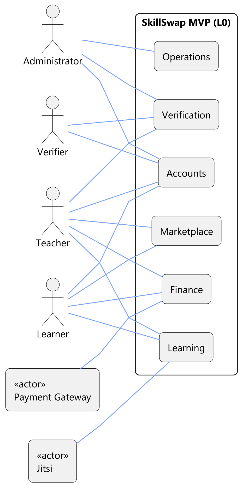

**Level 1 — Accounts (UC-006–UC-008)**

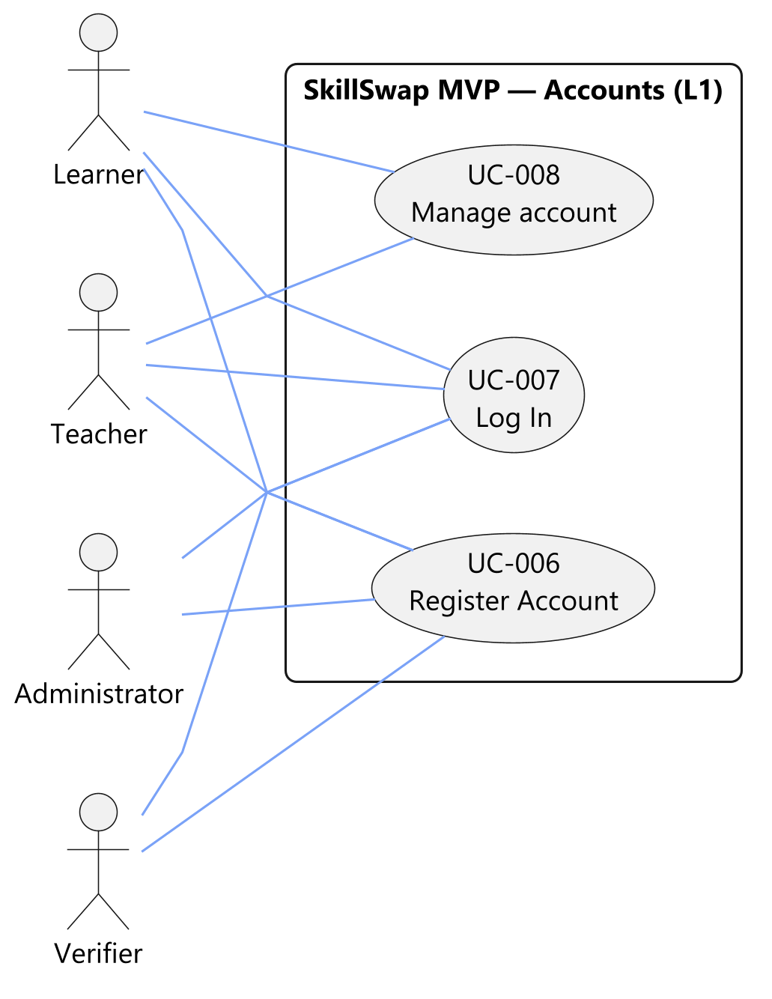

**Level 1 — Verification (UC-001, UC-002, UC-009)**

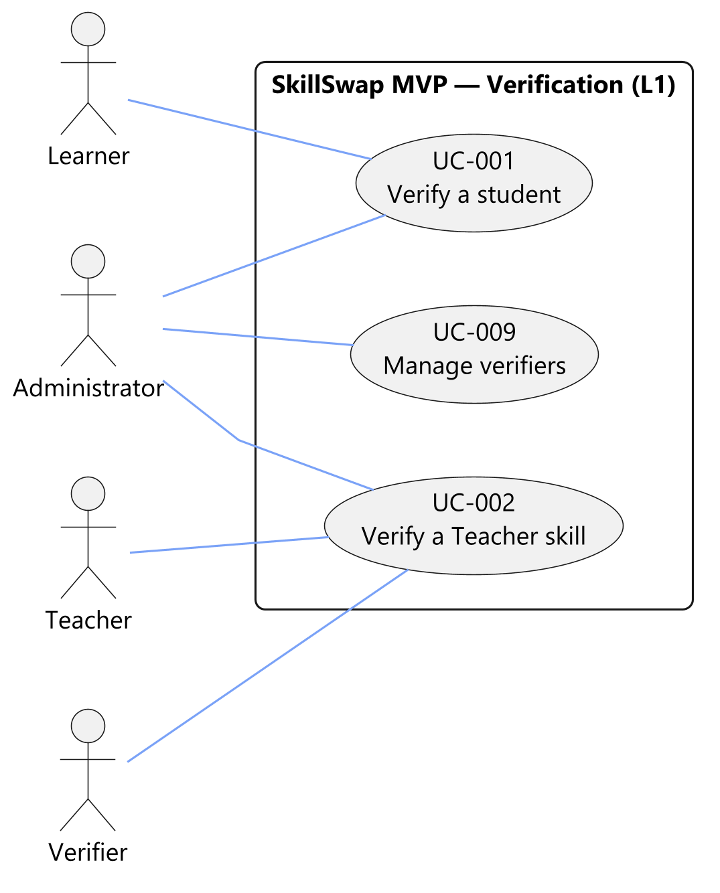

**Level 1 — Marketplace (UC-003, UC-010, UC-011)**

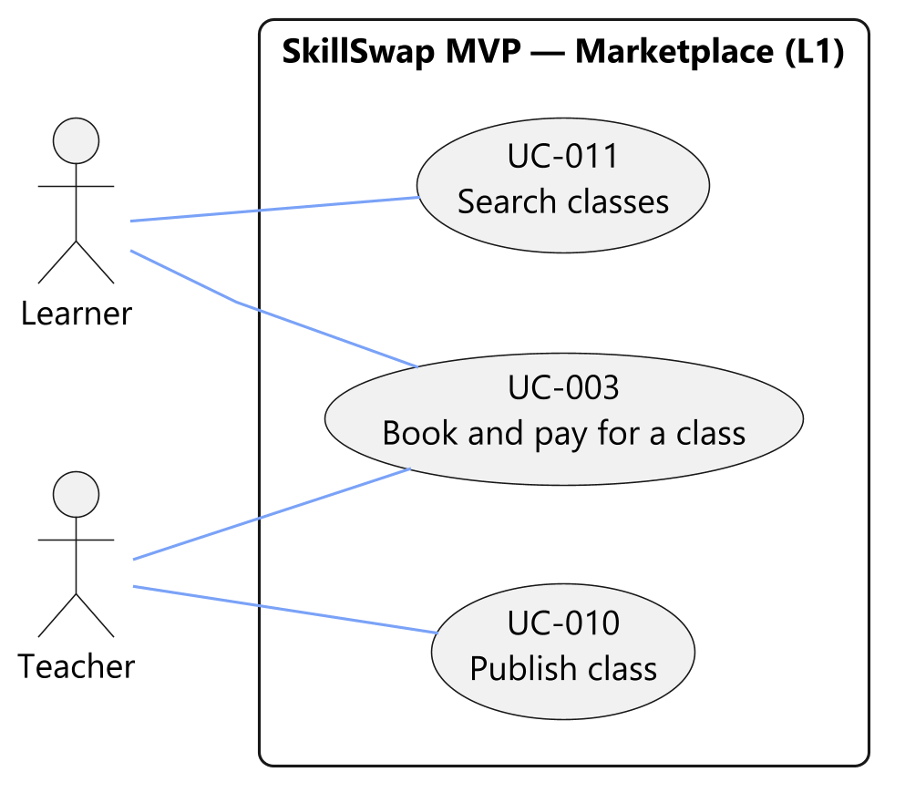

**Level 1 — Finance (UC-005, UC-012, UC-013)**

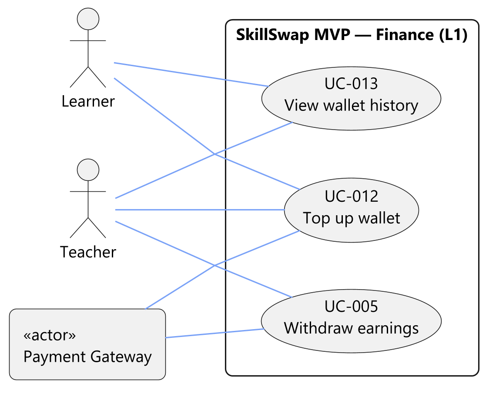

**Level 1 — Learning (UC-004)**

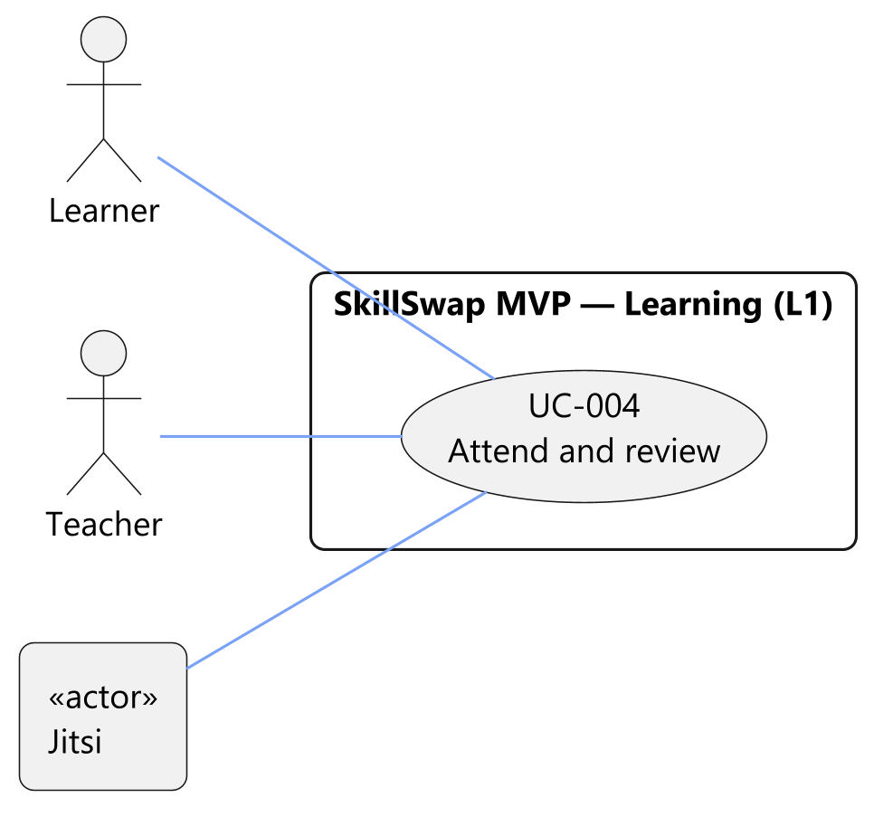

**Level 1 — Operations (UC-014)**

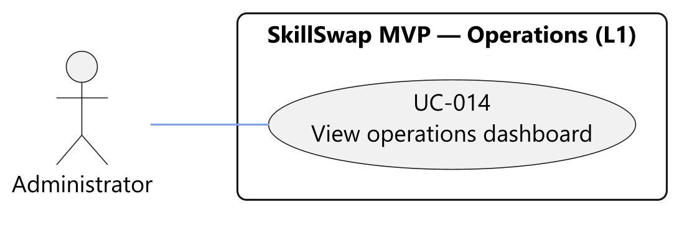

*Reading: every diagram shows the SkillSwap MVP boundary. The four human actors are stick figures outside it; Payment Gateway and Jitsi appear as `«actor»` boxes because they are external systems. Lines are unlabeled actor–use case associations — there are no include/extend dependencies, because each use case is a standalone user goal and authentication is captured as a Precondition instead of an included Log In use case (§3.2.5). Register Account (UC-006) and Log In (UC-007) are linked to all four user roles. Every use case carries the identical code and name on its level-1 diagram, in the Use Case List (§3.2.5) and in the traceability matrix (Appendix C.2).*

#### 3.2.5 Use Case List

One row per use case appearing on the diagrams, ordered by subsystem then code. Codes are immutable and names match the diagrams exactly.

| UC ID | Use Case Name | Primary Actor | Secondary Actor(s) | Subsystem | Description | Precondition | Relationships | Priority |
|---|---|---|---|---|---|---|---|---|
| UC-006 | Register Account | Learner, Teacher, Verifier, Administrator | — | Accounts | A prospective user creates an account (FR-001); it starts Pending and becomes Active after verification where applicable. | No account exists yet. | — | Must |
| UC-007 | Log In | Learner, Teacher, Verifier, Administrator | — | Accounts | An existing user authenticates and obtains the session required by every other use case. | Account registered (UC-006). | — | Must |
| UC-008 | Manage account | Learner, Teacher | — | Accounts | View and edit the profile, switch the active role view (FR-017), and read account status and rejection reason (FR-001). | Logged in. | — | Must |
| UC-001 | Verify a student | Learner | Administrator | Verification | Submit student-status evidence; an Administrator approves or rejects it, activating the account on approval (FR-002). | Logged in; verification not yet Approved. | — | Must |
| UC-002 | Verify a Teacher skill | Teacher | Verifier, Administrator | Verification | Submit skill evidence; a domain-matched Verifier (or the Administrator) decides, enabling class publication for that skill (FR-003, FR-018). | Logged in as a verified student; skill not yet Approved. | — | Must |
| UC-009 | Manage verifiers | Administrator | — | Verification | Invite Verifiers, assign review domains, and suspend or revoke their access (FR-004). | Logged in as Administrator. | — | Must |
| UC-003 | Book and pay for a class | Learner | Teacher | Marketplace | Book an open class and pay from the wallet; booking and ledger entries commit atomically (FR-007, FR-009). | Logged in; class Published with a free seat and sufficient balance. | — | Must |
| UC-010 | Publish class | Teacher | — | Marketplace | Create and publish a class listing for an Approved skill so Learners can discover and book it (FR-005). | Logged in as Teacher; at least one skill Approved. | — | Must |
| UC-011 | Search classes | Learner | — | Marketplace | Discover classes by skill, schedule, price and rating (FR-006). | Registered account. | — | Must |
| UC-005 | Withdraw earnings | Teacher | Payment Gateway | Finance | Withdraw available balance through the gateway; the payout completes exactly once (FR-014). | Logged in as Teacher; available balance > 0. | — | Must |
| UC-012 | Top up wallet | Learner, Teacher | Payment Gateway | Finance | Top up wallet credit through the payment gateway (FR-008). | Logged in. | — | Must |
| UC-013 | View wallet history | Learner, Teacher | — | Finance | Review balance, ledger entries and payout status with trace IDs (FR-010). | Logged in; wallet exists. | — | Must |
| UC-004 | Attend and review | Learner | Teacher, Jitsi | Learning | Join the Jitsi room in the permitted window, use in-class chat, and submit one rating after completion (FR-011–FR-013, FR-016). | Confirmed booking within the access window. | — | Must |
| UC-014 | View operations dashboard | Administrator | — | Operations | Review operational metrics and the audit trail (FR-015). | Logged in as Administrator. | — | Must |

*Notes: the Relationships column is `—` for every row because no include/extend relationships apply — each use case is a standalone user goal, and authentication is recorded as the Precondition `Logged in` (or `Registered account` / `Logged in as …`) instead of an included Log In use case. Priority follows the governing FR MoSCoW priorities (all Must). The primary/secondary split mirrors the associations drawn in §3.2.4.*

#### 3.2.6 State models

Five entity lifecycles are normative. Any transition not listed is forbidden.

**1. StudentVerification (FR-002, BR-001, BR-011)**

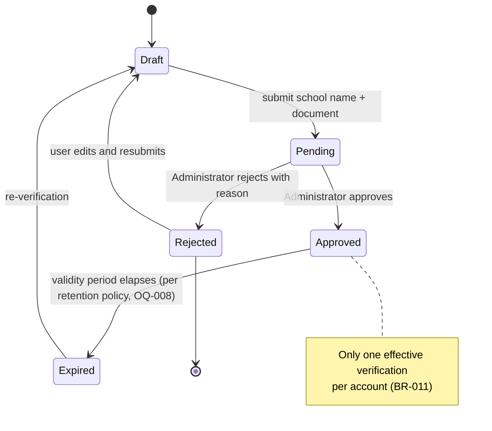

**2. SkillEvidence (FR-003, FR-018, BR-002)**

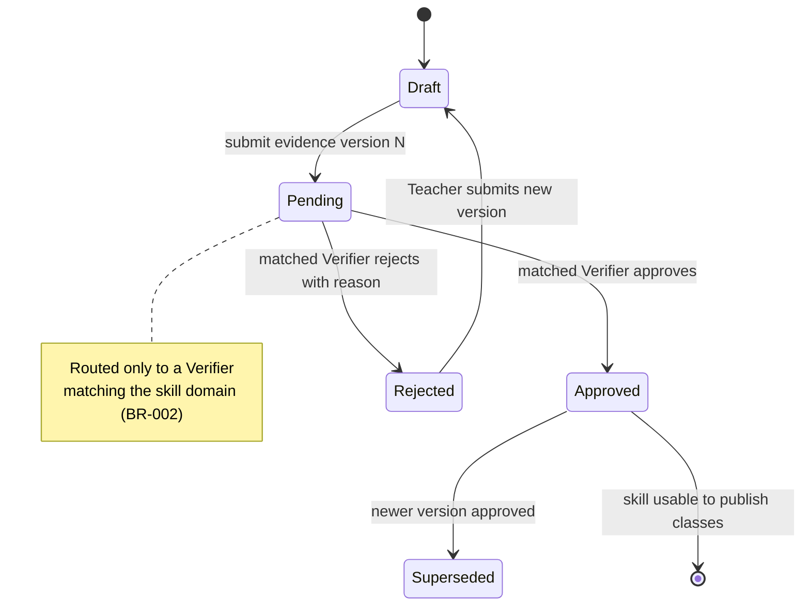

**3. Class (FR-005, FR-007, BR-003)**

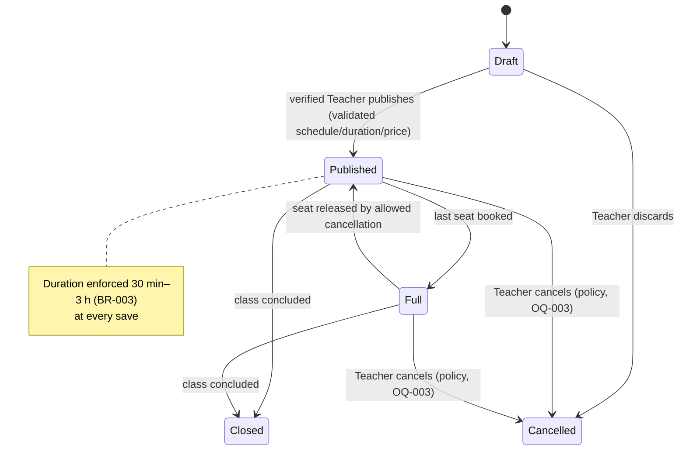

**4. Booking (FR-007, FR-009, FR-011)**

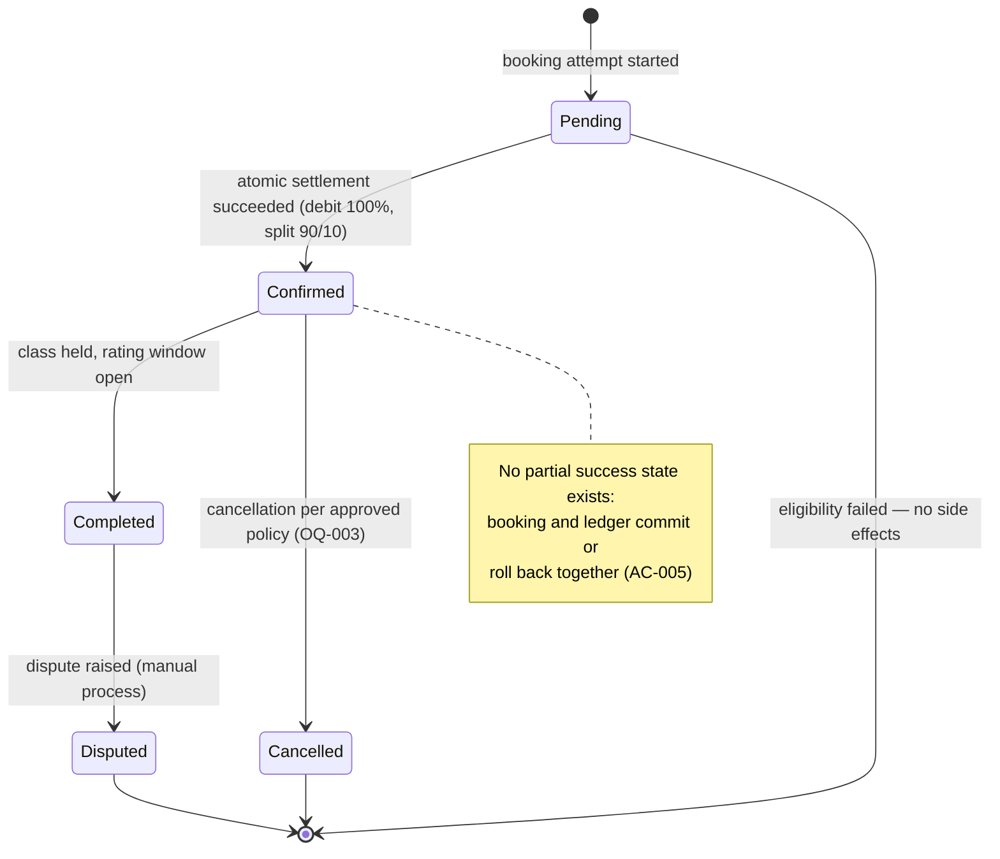

**5. WithdrawalRequest (FR-014, BR-005, BR-012)**

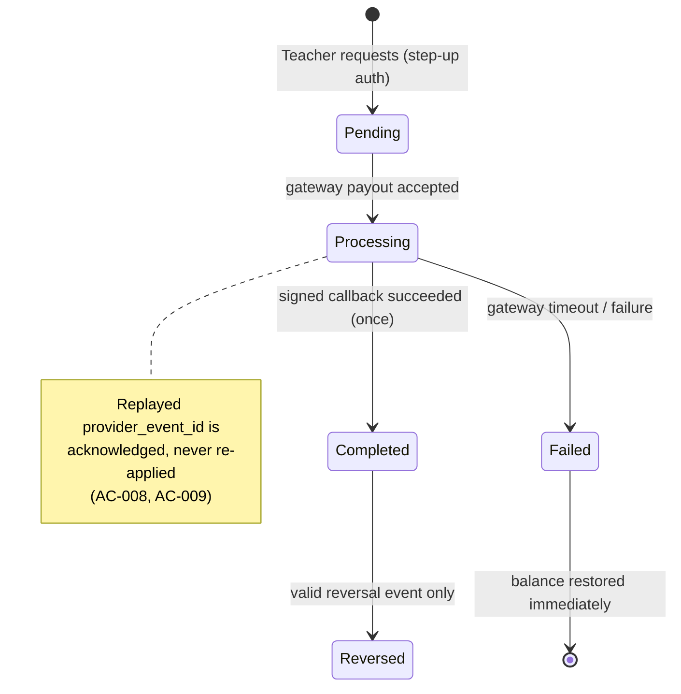

### 3.3 Performance requirements

| ID | Requirement | Measurement | Priority |
|---|---|---|---|
| NFR-011 | Search results shall be returned promptly at MVP data scale. | Basic load test (target latency to be fixed by Product Owner — OQ-010 excluded, see Appendix A). | Should |
| NFR-012 | Uptime appropriate to the pilot stage shall be maintained. | Uptime monitoring. | Should |
| NFR-003 | Concurrent or retried financial requests shall produce exactly one balanced financial outcome and never a negative balance. | Idempotency, concurrency and reconciliation tests. | Must |
| NFR-006 | Validation/gateway/Jitsi failures shall preserve recoverable user input and show actionable errors. | Negative-path tests for forms, gateway and Jitsi. | Should |

### 3.4 Design constraints

1. **Architecture:** Next.js frontend, NestJS backend, PostgreSQL via TypeORM/Prisma (C-008); Jitsi room provisioning and token issuance by backend; media flows directly over WebRTC.
2. **Atomicity:** all booking/settlement writes occur in a single database transaction; no partial financial success (NFR-003, AC-005).
3. **Idempotency:** every financially effective command requires an idempotency key and trace ID (PRD §10 integration rules).
4. **Authorization:** server-side role/ownership checks on every endpoint; Administrator/Verifier require MFA; payouts and payout-destination changes require step-up authentication (NFR-009).
5. **Mobile-first:** responsive layouts validated at 360 px, 390 px and desktop (NFR-001, C-006).
6. **Localization:** Vietnamese/English with locale-complete routes (NFR-002, C-007).
7. **Legal:** personal-data handling for identity documents must follow applicable data-protection rules; funds flow exclusively through a licensed gateway; Terms of Service must state Teacher tax responsibility and the under-18 policy (BRD §12).

### 3.5 Software system attributes

**Reliability / availability (NFR-003, NFR-006, NFR-012):** no inconsistent financial states under retry/concurrency; pilot-grade uptime with monitoring.

**Security (NFR-004, NFR-008, NFR-009, NFR-010, PRD §13):**

- Only the owner and authorized reviewers may access verification documents.
- Uploads validated by extension, MIME and file signature, size-limited (10 MB images/PDF per PRD §6.2), malware-scanned, stored outside executable paths, previewed in a sandboxed frame.
- Webhooks authenticated by signature, timestamp and replay nonce; secrets stored outside source control, separated per environment, rotatable.
- Chat/rating content treated as untrusted, context-encoded, rendered under a Content Security Policy (stored-XSS tests).
- Jitsi access uses short-lived tokens for booking participants inside the permitted window only (AC-006).
- Privileged actions, verification decisions, role changes, financial transitions and payout-destination changes are audited with actor, timestamp and trace ID (FR-015, NFR-005).

**Maintainability:** requirements, acceptance criteria and tests keyed by stable IDs (FR/BR/NFR/UC/AC) enabling the traceability matrix in Appendix C.

**Portability:** responsive web only; browser support covers current mobile and desktop browsers (BRD §4.1).

**Accessibility (NFR-007):** WCAG 2.2 AA on main flows — keyboard navigation, visible focus, screen-reader labels.

**Privacy (NFR-004, NFR-005):** sensitive data (student IDs, certificates, payout destinations, financial history) encrypted in transit and at rest and excluded from logs; top-up/settlement/payout flows carry an end-to-end trace ID without secret leakage.

### 3.6 Other requirements

- **Data handling (PRD §9):** access is server-authorized by role and ownership; sensitive files encrypted in transit/at rest, stored outside executable paths, never written to application logs.
- **Auditability (NFR-005):** trace one sample transaction through gateway → API → ledger.
- **Testing evidence:** acceptance criteria AC-001–AC-010 (Appendix C) must pass before the corresponding increment is Delivery Ready (PRD §14).

### 3.7 Open items blocking implementation

Implementation of the clauses listed in Appendix A is blocked until the corresponding Open Question is approved (decision policy: **block until resolved**). Affected increments per PRD §14: Increment 3 (OQ-001, OQ-007), Increment 4 (OQ-002, OQ-003, OQ-005, OQ-006, OQ-011), storage/lifecycle design (OQ-008), Increment 5 (OQ-004, OQ-009), pilot planning (OQ-010).

---

## Appendix A — Excluded open-question-governed clauses

Confirmed cores of these requirements appear in §3.2.1; the following **dependent clauses are intentionally excluded** from this SRS until the governing OQ is approved (BRD §11).

| OQ | Decision required | Owner | Affects | Excluded clause (not specified in this SRS) |
|---|---|---|---|---|
| OQ-001 | Skill taxonomy structure and search granularity. | Product Owner | FR-003, FR-005, FR-006 | Exact category tree, free-text/tag hybrid, search index behavior. |
| OQ-002 | Teacher self-pricing vs. price bands vs. hybrid with floor/cap. | Product Owner | FR-005, FR-007–FR-009 | Price rules, minimum/maximum price validation. |
| OQ-003 | Cancellation, no-show, dispute, manual refund and Admin enforcement workflow. | Product Owner + Administrator | FR-007, FR-009–FR-011, FR-013 | Cancellation paths in Class/Booking state models, refund handling, dispute procedure. |
| OQ-004 | Rating threshold, minimum review count, visibility recovery. | Product Owner | FR-006, FR-013 | Down-ranking threshold mechanics (BR-009 value). |
| OQ-005 | Withdrawal conditions, limits, fees, processing time. | Product Owner + Finance | FR-010, FR-014 | Minimum/maximum payout, fees, SLA in WithdrawalRequest model. |
| OQ-006 | When the Teacher's 90% moves pending → available; chargeback/reversal handling. | Product Owner + Finance | FR-008, FR-009, FR-014 | Settlement release timing (value behind `Completed → Reversed` policy). |
| OQ-007 | 1-1 vs. group classes; capacity and seat hold/release rules. | Product Owner | FR-005, FR-007 | Capacity semantics in FR-007, seat-hold logic around Full ⇄ Published. |
| OQ-008 | Verification validity period, document retention/deletion, expiry cascade. | Product Owner + Security | FR-002–FR-005, FR-007, FR-011, FR-014, NFR-004 | Retention duration, `Approved → Expired` timing, deletion/anonymization rules. |
| OQ-009 | Chat handling of detected personal contact info: block / warn+log / log only. | Product Owner | FR-012 | Enforcement mechanism behind BR-008. |
| OQ-010 | Target values for success metrics and pilot scope. | Product Owner | Product rollout | Quantified performance/availability targets for NFR-011/NFR-012. |
| OQ-011 | Payment gateway selection (top-up, payout, webhook, reconciliation, reversal). | Engineering + Finance | FR-008, FR-014 | Gateway-specific integration contract in §3.1.3. |

## Appendix B — Data dictionary

Derived from PRD §9. Access is server-authorized by role and ownership; sensitive files are encrypted in transit and at rest.

| Entity | Key fields | Relationships | Lifecycle | Classification | Owner |
|---|---|---|---|---|---|
| User | id, roles, school_name, verification_status | Has verification, wallet, classes/bookings | Pending → Active → Suspended | PII | User/Admin |
| StudentVerification | id, user_id, document_ref, status, reviewer_id, reason, expires_at | Belongs to User | Draft → Pending → Approved/Rejected/Expired | Sensitive identity document | Administrator |
| SkillEvidence | id, teacher_id, skill_id, document_ref, version, status | Belongs to Teacher and Skill | Draft → Pending → Approved/Rejected/Superseded | Sensitive credential | Teacher/Verifier |
| VerifierAssignment | id, verifier_id, domain, status, assigned_by | Links Verifier to review domain | Invited → Active → Suspended/Revoked | Internal access-control data | Administrator |
| Class | id, teacher_id, skill_id, schedule, duration, price, capacity, status | Has Bookings | Draft → Published → Full/Closed/Cancelled | Public marketplace data | Teacher |
| Booking | id, class_id, learner_id, status, settlement_id | Links Class, Learner and ledger | Pending → Confirmed → Completed/Cancelled/Disputed | Private transaction data | Learner/Teacher |
| Wallet | id, user_id, available_balance, pending_balance | Has ledger entries | Active → Restricted/Closed | Financial | User/Platform |
| LedgerTransaction | id, wallet_id, type, amount, rate, status, trace_id, idempotency_key | Links top-up, booking or withdrawal | Pending → Posted/Reversed/Failed | Sensitive financial | Platform |
| Message | id, class_id, sender_id, body, created_at | Belongs to class conversation | Active → Retained/Deleted | Private communication | Participants/Platform |
| Rating | id, booking_id, learner_id, score, comment | One policy-valid rating per Booking | Published → Hidden/Updated by policy | Public content + private provenance | Learner/Platform |
| WithdrawalRequest | id, teacher_id, amount, destination_ref, status, trace_id | Produces ledger entries | Pending → Processing → Completed/Failed/Reversed | Sensitive financial | Teacher/Platform |

## Appendix C — Acceptance criteria and traceability

### C.1 Acceptance criteria (AC-001–AC-010)

- **AC-001 / FR-002:** Given a school name and a valid file, when the user submits, the status is Pending and an Administrator can review it.
- **AC-002 / FR-003–FR-005:** Given an unapproved skill, when a Teacher attempts to publish a class, the system refuses and directs them to complete verification.
- **AC-003 / FR-007:** Given a class starting in under 24 hours, when a Learner books, no booking is created and no credit is deducted.
- **AC-004 / FR-009:** Given a 100-credit class and sufficient balance, when purchased, the ledger debits 100, allocates 90 to the Teacher pending settlement, records the 10 fee, and creates exactly one booking.
- **AC-005 / FR-009:** Given a settlement step failure, the transaction ends with no booking or balance in a partially successful state.
- **AC-006 / FR-011:** Given a user outside the booking or outside the access window, when they open the room, access is denied.
- **AC-007 / FR-013:** Given a completed class and an eligible Learner, when a valid rating/comment is submitted, the review links to the booking and cannot be duplicated.
- **AC-008 / FR-014:** Given a valid payout callback replayed, the withdrawal completes exactly once.
- **AC-009 / EVT-001:** Given a valid callback older than the processed gateway state, the system acknowledges it but does not lower the status.
- **AC-010 / FR-007:** Given a class with one seat left, when two Learners book near-simultaneously, exactly one booking confirms; the other receives a full-class error with no credit deducted.

### C.2 Traceability matrix

| Business goal | Requirements | Use case | API / data / NFR |
|---|---|---|---|
| Trusted student identity | FR-001, FR-002, FR-017 | UC-001, UC-006–UC-008 | API-001, User, StudentVerification, NFR-004/008/009 |
| Trusted Teacher capability | FR-003–FR-005, FR-018 | UC-002, UC-009, UC-010 | API-002–API-004, SkillEvidence, VerifierAssignment, NFR-004/009 |
| Discover and book online learning | FR-005–FR-007 | UC-003, UC-011 | API-004–API-005, Class, Booking, NFR-001/006/007 |
| Traceable wallet settlement | FR-008–FR-010, FR-014 | UC-003, UC-005, UC-012, UC-013 | API-005–API-007, EVT-001, Wallet/Ledger/Withdrawal, NFR-003/005/009 |
| Secure class participation | FR-011–FR-013, FR-016 | UC-004 | API-008–API-010, Message/Rating, NFR-006/007/010 |
| Platform operations | FR-015 | UC-014 | Audit log, NFR-005 |

### C.3 Diagrams index

Use case diagrams are authored in PlantUML (`docs/diagrams/usecase/srs-use-case-*.puml`) and referenced as PNGs, because GitHub does not render PlantUML natively; state diagrams and the C4 context embed Mermaid/PNG as noted.

| Diagram | Section | Syntax | Rendered PNG |
|---|---|---|---|
| Use case level 0 (actors × subsystems) | §3.2.4 | PlantUML `usecase`/`rectangle` (straight links) | `docs/diagrams/usecase/srs-use-case-l0.png` |
| Use case level 1 — Accounts (UC-006–UC-008) | §3.2.4 | PlantUML `usecase` (straight links) | `docs/diagrams/usecase/srs-use-case-accounts.png` |
| Use case level 1 — Verification (UC-001, UC-002, UC-009) | §3.2.4 | PlantUML `usecase` (straight links) | `docs/diagrams/usecase/srs-use-case-verification.png` |
| Use case level 1 — Marketplace (UC-003, UC-010, UC-011) | §3.2.4 | PlantUML `usecase` (straight links) | `docs/diagrams/usecase/srs-use-case-marketplace.png` |
| Use case level 1 — Finance (UC-005, UC-012, UC-013) | §3.2.4 | PlantUML `usecase` (straight links) | `docs/diagrams/usecase/srs-use-case-finance.png` |
| Use case level 1 — Learning (UC-004) | §3.2.4 | PlantUML `usecase` (straight links) | `docs/diagrams/usecase/srs-use-case-learning.png` |
| Use case level 1 — Operations (UC-014) | §3.2.4 | PlantUML `usecase` (straight links) | `docs/diagrams/usecase/srs-use-case-operations.png` |
| StudentVerification state machine | §3.2.6 | Mermaid `stateDiagram-v2` | `docs/diagrams/srs-state-student-verification.png` |
| SkillEvidence state machine | §3.2.6 | Mermaid `stateDiagram-v2` | `docs/diagrams/srs-state-skill-evidence.png` |
| Class state machine | §3.2.6 | Mermaid `stateDiagram-v2` | `docs/diagrams/srs-state-class.png` |
| Booking state machine | §3.2.6 | Mermaid `stateDiagram-v2` | `docs/diagrams/srs-state-booking.png` |
| WithdrawalRequest state machine | §3.2.6 | Mermaid `stateDiagram-v2` | `docs/diagrams/srs-state-withdrawal-request.png` |
| System context (C4 L1) | §2.1 | Embedded PNG from `docs/diagrams/c4/generated/` | `docs/diagrams/c4/generated/structurizr-SystemContext.png` |
